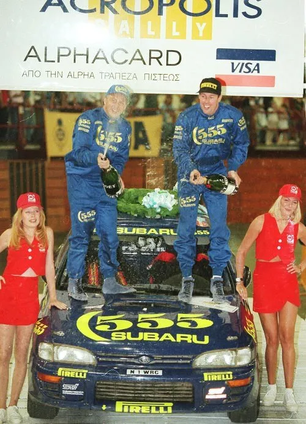

# Colin McRae - The Photo Story

This week marked one year since the death of Colin McRae. Part 1 of this thread
takes Colin from teenager in a Vauxhall Nova to World Rally Superstar.

I first saw Colin drive a rally car in 1987 when he ran this Group A 1300cc
Vauxhall Nova Sport, he was known to finish in the top 10 of international
rallies in this car, he did that by carrying more speed through corners than any
other driver, Colin always did it his way when it came to attacking a corner,
his style was a million miles away from the slow in and fast out technique which
most drivers employ. It was obvious even at this stage that Colin was going to
be a top driver.

Colin's first outings in a competitive Group A car came in various Sierra
Cosworths. Here he is during the 1990 Ypres 24 Hours in Belgium, an early
overseas event in his career.

For 1991 Colin signed a contract with Prodrive to run a Group A Subaru Legacy in
the British Rally Championship, this was a very successful partnership, gaining
them the title in 1991 & 1992. As early on as 1991 McRae led Britain's WRC round
only to crash out, much to the dissapointment of all British rally fans!

1992 saw Prodrive give a limited WRC programme to McRae, this netted some
reasonable results considering Colin's inexperience on the events. 1993 would be
a pivotal year in McRae's career, he won the Rally of New Zealand in a Legacy,
this was the cars last appearance at top level, so the Subaru bosses were
delighted with the result, it also marked the end to a 17 year drought for
British rally drivers on the WRC, Roger Clark being the last driver to win an
event (1976 RAC)

Here is Colin on the 1993 Tour de Corse in a Prodrive Legacy, Colin described
this car in an interview many years later as his favourite Subaru rally car, he
said it had just the right amount of technology without spoiling the driver
input, these were the very early days of active diffs etc.

Not sure what this photographer is taking a photo of!

1994 saw the switch to the more compact and nimble Impreza, a poor start to the
season almost brought his career at Subaru to an end, the top brass in Japan
called for him to be sacked but it was Dave Richards who stepped in and said no,
perhaps he saw a bit of Ari Vatanen in Colin (a driver who Richards had nurtured
in his co driving days) three WRC wins came later in '94, including a hugely
popular win on his home event.

By 1995 Colin was without doubt the fastest rally driver in the WRC, he did have
a bit of a crash or win reputation but he really did deliver the goods.

McRae made the Rally of New Zealand his event in the early 90's, 1995 saw him
complete a hat-trick of wins on the event.

The penultimate round of the 1995 WRC, Colin was leading the champiopnship ahead
of his team mate Carlos Sainz, even though they were at the Spanish round, there
was no doubt that McRae was the faster driver and as far as he was concerned,
beating Carlos in his own back yard was just a formality.

Subaru driver line up for the 1995 Catalunya Rally - McRae, Sainz and Liatti.

McRae set off into the lead, driving at his very best, the way we all love to
remember him.

By the last day of the event, team orders were issued by Dave Richards, the
orders were for Colin to drop back and Carlos to win, a big argument allegedly
went off between McRae and Richards but he had to obey in the end, Richards and
his Prodrive team had a deal with sponsors 555 Subaru, if they took the drivers
title a huge cash bonus would go their way, if Carlos and Colin finished 1-2
then this would be assured, the question was would it be Colin or Carlos who
took the title at the RAC Rally.

It was a love/hate relationship between driver and team boss.

Colin had a storming drive on the RAC and Carlos retired.

It was all smiles as Colin became the youngest ever World Rally Champion. As a
schoolboy spectator I had often wondered if a British driver would win a WRC
event, never mind the actual WRC title, this was the stuff of dreams to British
rally fans - Happy days

---

Colin got off to what he saw as a disappointing start in 1996, as he set out to
defend his world championship title. Eventually he took his first victory of the
season on the Acropolis Rally, on what turned out to be the first of five wins
in Greece for him.

Finland ended in a big accident and another heated conversation with Dave
Richards who had hoped Colin would go for a points finish and try to learn the
event, but Colin was a win or lose driver back then and he so wanted to win in
Finland.

McRae ended the season with victories on the Sanremo and Catalunya rallies, here
is Colin on that very Catalunya Rally, showing that he had lost none of his
daring driving style that won him fans worldwide.

Despite the late season's successes, all was not well in the cockpit of the
Impreza, and the pairing of Colin McRae and Derek Ringer came to an end, Colin
had finished a respectable second overall in the 1996 WRC but had lost the title
to Tommi Makkinen by a massive 31 points.

A fresh start for 1997, Nicky Grist joined McRae to read the notes, Grist was a
hugely experienced co driver, he had sat alongside the four time World Champion
Juha Kankkunen for the previous three seasons. Also, a new car from Subaru, gone
were the Group A regulations and with them the four door Impreza that British
rally fans had grown to love, a new formula called World Rally Car was with us
and Subaru had rolled out a new two door Impreza with bulging arches.

McRae & Grist flying high in the Impreza WRC

Again the season started badly with retirement on the Monte Carlo and fourth on
the Swedish (to be fair, the top four on that year's Swedish were split by just
31 seconds, unfortunately Colin was at the back of that very close pack) Next up
was the Safari, Colin proved his doubters wrong, they said no way would a car
wrecker like McRae ever win the gruelling Safari, but he took a convincing
victory.

Another three events on, Makinen had taken a comfortable lead in the
championship, Tommi was proving a match for McRae and he was enjoying better
reliablility. Colin was getting used to seeing this sight. McRae and Makinen
were great rivals on the rally stages but great friends away from the sport,
Colin considered Tommi to be the finest driver of his era.

McRae and Grist fought back with a win in Corsica (another specialist event
which is rarely won by non French drivers even today)

Finland, another error by McRae:headspin: Meanwhile, even worse, Makinen took
the third of five back to back victories in Finland, (Finland is the fastest
event in the WRC) I guess this was one of the reasons that Colin held Tommi in
such high esteem.

Colin did his now usual end of season superstar performance, winning the last
three events of '97 - Italy, Australia & GB, he was again beaten to the title by
a frustrating one point margin by Makinen, McRae must have wished he'd collected
some points in Finland.

1998 was to see a similar pattern to 1997, Colin winning regularly but feeling
that Subaru were not offering him a reliable enough car to take the title, this
time he finished third in the title chase, behind Sainz and the again champion
Makinen.

Colin never won the Monte Carlo, he didn't like the event, although he came
close to winning it on more than one occasion. Here he is in 1998.

Corsica 1998, just look at the crowd reaction, you can be sure that the first
two cars on the road had been through this corner like racing cars, Colin never
let the spectators down 

By now, another British rally driver was on the scene, Richard Burns, his
driving style was immaculate compared to McRae's, this was to be a halcyon
period for British rallying, they finished 1-2 on WRC events on more than one
occasion, this would have been considered unthinkable just a few years earlier.
I can't believe I am typing this in 2008 with the knowledge that both drivers
are no longer with us:sosad: But what a great period in the sport that was, we
should look back with good memories

---

Part 3 - The Ford years.

For 1999 Colin had made a somewhat brave decision to go with a brand new project
from Ford, it was to be run by a new team (M-Sport) who had never actually won a
WRC event, Ford had closed down it's official team at Boreham and decided to
farm out their rally operation (M-Sport had previously been know as Malcolm
Wilson Motorsport)

The Focus WRC was finished just in time for Monte Carlo Rally, the big question
was - Would the car be competitive? Thankfully it was quick straight out of the
box, but the car was excluded for a minor technical issue. Next was Sweden, an
engine failure caused retirement, maybe going with such a new project was not
such a good idea.

Next up was the most gruelling event on the WRC for any car and driver, the
Safari. Colin had already won the event for Subaru, but the Focus was so new,
and so far fragile. Yet again Colin showed the doubters with a win that amazed
everybody, the new pairing of McRae and Ford had taken it's first win.

Another victory just a few weeks later on the Rally of Portugal gave the team a
big boost of confidence, M-Sport were now a serious player on the WRC.

Corsica gave the car it's first WRC points on tarmac, a very respectable 4th
overall, this sounds a poor result but you have to remember that the FWD Zsara
kit cars finished 1-2 due to their weight advantage over the WRC cars, McRae
actually split the works Toyotas of Sainz and Auriol.

Colin didn't finish another event for the rest of 1999, this was due mainly to
reliability issues, and the odd McRae crash!

Acropolis 1999.

2000 and a new car, gone was the F1 style rear wing, here is the car at service
during the Monte Carlo Rally.

A run of podium finishes during the 2000 season gave McRae a real shot at
regaining the WRC title. However, it went badly wrong in Corsica, McRae was
pushing hard when he clipped the edge of the road, this was just enough to
launch the car, sending it rolling into the scenery where it landed upside-down,
co-driver Grist was eventually able to get free from the wreckage but Colin was
trapped in the car.

McRae was hanging upside-down in the car, by now petrol was beginning to drip
inside the car, Colin had plenty of time to reflect on his life at this point,
he had a wife, family, palatial home and a huge fortune in the bank (Not only
had he made Łmillions from his driving talents, he had also made a fortune from
his name rights on the Sony Playstation game Colin McRae Rally) Did he really
need to be taking these risks anymore? Thankfully the rescue services managed to
free Colin, he sustained a broken cheek bone and serious concussion.

Colin after the accident.

Less than three weeks later and it was the next round of the WRC, the Sanremo
Rally, if Colin was going to have a go at the title, he would have to turn up
and get a points finish (Top 6 back then) He was cleared to start, his brave
efforts brought 6th place overall, I say brave efforts because Colin was driving
the special stages and Grist was doing all the other driving in between as Colin
slept (The sleeping was a side effect of concussion)

An engine failure on the next round in Australia was cruel luck for all McRae's
efforts, this ended his chase for the title.

2001 - A very slow start to the season, zero points were scored during the first
four rounds, this was followed by three back to back wins in Argentina, Cyprus
and Greece. All of a sudden, Colin was yet again back in the title hunt.

Next up was the Safari, but sadly a retirement for McRae.

Next followed a good solid result in Finland, 3rd overall.

This was followed by 2nd in New Zealand, behind winner Burns who was now
becoming McRae's biggest title rival, but McRae still had a points advantage
over his British rival. The next three rounds netted Burns 9 points and McRae
just 2 points, this meant that they arrived at their home round of the
championship with McRae on 42 points and Burns on 40 points. For the first time
in the history of the WRC, it was an all British shootout between British
drivers for the title.

McRae set off as only he knew how - Totally flat out. This was to last just a
few stages before Colin had a huge accident, the in car footage of McRae and
Grist showed the body language and disappointment of losing the title in this
manner.

The photos from outside the car showed the severity of the accident.

2002 - A steady collection of points came until mid season victories in Greece
and Africa. It should be noted that McRae had an incredible ability to endure
heat on such rallies, other drivers would wear t-shirts on such events inside
the cockpit, where McRae would wear his usual fireproof overalls.

2002 Safari Rally victory

A mixed season continued, here is McRae finishing an unusually low 8th overall
on the Sanremo.

Next followed the Rally of New Zealand, this had been happy hunting ground for
McRae over the years, but what followed was hell inside the car, McRae went off
the road and retired, he blamed Grist for making a mistake on the notes, a
massive row followed and sensationally they parted company, equally sensational
was the return to the co-driver seat of Derek Ringer for the last two rounds of
the 2002 season!

The reformed pairing showed up in Australia but a suspension failure caused
retirement.

Last round of the 2002 season was the GB round, anyone who thought Colin had
given up exploring parts of the stages that others dare not to, well, they were
wrong.

The event didn't go perfectly for Colin, 5th overall and his very last event for
Ford. It had been a pretty successful pairing between McRae and Ford, four
years, nine wins and lots of Ford Focus sales round the world.

---

A few photos from the day that Colin tried out a bit of S14 Power!

Knockhill, Scotland 1992, Colin was a works driver for the Prodrive team on the
British Rally Championship at that time in a Subaru Legacy, Dave Richards
decided to give him a chance to show his talents in a Prodrive 318i, of course
the 318i BTCC cars of 1992 were actually powered by 2 litre S14 units. Colin
qualified 15th but finished an excellent 8th overall in the first round of the
day, in the second round he finished 5th overall, beating Steve Soper in a Vic
Lee prepared 318i, not bad for a rally driver, he was however excluded from his
5th place for what was reported as a 'robust' overtaking manoeuvre involving
Matt Neal.

Colin traded in his Rothmans race suit for a plain white number on that wet July
day 16 years ago.

You can however make out the Rothmans stripes on his helmet in this shot.

---

2003 - By now McRae had won wore WRC rounds than any other driver (25) and
signed a big money deal to drive with the French Citroen team, it was a star
studded line up, team mates were Carlos Sainz and an up and coming driver by the
name of Sebastien Loeb.

First event of 2003 was a dream start for the Citroen team with a 1-2-3 finish
on the Monte Carlo Rally. McRae took second place behind Loeb, this would
however be Colin's best result for the team all season.

The rest of the 2003 season was frustrating for Colin, this was partly due to
some bad luck, and perhaps the fact that the WRC cars were becoming more train
like (i.e. on rails!) and this did not suit his driving style, where Sainz and
Loeb were more precise in their style. He did bring many points finishes though.

Finland, flying high B) ....

....followed by a typical McRae crash :o

It was decided by the FIA that for the 2004 WRC season only two points scoring
drivers would be allowed in each team, this left Citroen with a difficult
decision, it was Colin who would have to leave the team, Sainz and Loeb had
better results during 2003. Colin McRae would be left without a drive for the
2004 season!

Colin managed to secure a drive on the Dakar Rally in 2004 & 2005 for Nissan, he
showed great promoise, setting some fastest times.

He also returned to old employer Prodrive for a one off drive in the 2004 Le
Mans 24 Hours, his team mates were Rickard Rydell and Darren Turner, Colin
apparently held up well against his more experienced race driving team mates,
they finished an impressive 9th overall in this Ferrari 550.

Two years passed before Colin was back back in the WRC fold, an invite came from
Skoda to run a car on the 2005 Rally GB, Colin did a good job and brought the
car home in 7th overall. The result was however totally irrelevant, Markko
Martin's Peugeot crashed into a tree and his British co driver Micheal Park was
killed :(

McRae on a spectator stage on the 2005 Rally GB. He had made up with Nicky Grist
and they were a team (Again!!)

Skoda offered McRae a further outing on the 2005 Rally Australia, he nearly
pulled off what would have been an amazing second overall finish but was dashed
with a clutch problem, he showed that he still had what it took though.

Colin's final WRC appearance came unexpectedly when Loeb injured himself in a
cycling accident, he made a one off showing for Citroen on the 2006 Rally of
Turkey, it was a problematic and frustrating rally though, mechanical problems
causing McRae and Grist to finish outside the top ten.

In August 2007 Colin stated that he still fancied another drive in the WRC, but
he also admitted that time was running out (He was now 39)

What came next rocked the world of motorsport to the very core. I remember
getting a phone call from my dad, he said it had just been on TV that Colin
McRae's helicopter had come down near his house in Lanark, it looked bad, it was
:( Colin was dead, along with his son and two friends. All the years of risk
taking on the WRC, nobody ever thought Colin would end up losing his life in
this manner.

Colin McRae 1968-2007

---

_autohabit, 2008_
