# The Group B Supercars

1982 saw the launch of what would turn out to be the most spectacular and
exciting period in the history of rallying, a new formula was introduced called
Group B, car designers were given an almost free hand, a minimum run of 200 cars
had to be made, this allowed the use of spaceframe technology and expensive
materials.

Arguably the first proper Group B car was the Lancia 037, or to call it by its
correct name, the Lancia Rally (037 was its development code number). The car
used a mix of glassfibre and Kevlar body panels, titanium rollcage and
spaceframe steel chassis. The RWD machine weighed in at 980kg and used a
mid-mounted four cylinder supercharged engine, initially producing 260bhp, which
was rapidly developed to ultimately produce 325bhp.

The car was homologated in time for the only all tarmac round of the 1982 WRC -
The Tour de Corse. One of the most impressive line ups ever seen on a WRC event
turned out for the start, Renault had a trio of 5 Turbos for Ragnotti, Therier
and Saby, Pozzi - the French Ferrari importer entered two 308 GTB models,
including one for Frenchman Jean Claude Andruet, there were also four Porsche
911SC, a BMW M1, three works Quattros, Ascona 400's for Rohrl and Kleint. Lancia
brought two cars, one for Markku Alen and another for the Italian driver Attilio
Bettega.

Bettega made a good start, initially holding second place behind Andruet's
Ferrari.

Ragnotti quickly got to grips with his Renault, taking the lead of the rally by
stage 6, this pushed Bettega's Lancia down to third. However, what happened on
stage 11 highlighted how potentially dangerous these spaceframe cars could be,
Bettega hit a wall, the pedals ended up underneath his seat, breaking his legs
badly, it took over half an hour to cut Bettega free from the 037.

Markku Alen finished a somewhat lowly ninth overall in Corsica, retirements
followed for Alen in Greece, Finland and Italy, it was not until the RAC Rally
in November that he gave the car its first reasonable finish, fourth place. But
1982 was never meant to be anything but a development year for the 037.

Alen on the 1982 Sanremo

For 1983 Lancia signed German ace Walter Rohrl, it was a dream start to the '83
season, Rohrl and Alen taking a 1-2 victory on the Monte Carlo Rally.

Walter Rohrl - Monte Carlo winner 1983

Next Lancia outing was Portugal, Rohrl and Alen finishing 3-4, beaten by the
Quattro pairing of Mikkola and Mouton, Lancia and Audi shared the manufacturers
lead with 32 points each.

Lancia opted to stay 'out of Africa' and made major preparations for the all
tarmac Tour de Corse instead.

When the Italians went rallying back in the 1980's, they did it in force, four
Martini cars, from the front No.1 Andruet, No.5 Rohrl, No.14 Bettega (returning
to competition exactly one year after that horrific crash) and No. 9 Alen

This was to be the last ever works outing for the legendary pairing of
Jean-Claude Andruet and his female co driver "Biche", they had won the first
ever WRC event, the 1973 Monte Carlo Rally.

Andruet was out on the second day, water from the cooling system had leaked into
the cylinder bores at service, causing the engine to seize.

Lancia took the top four places at the end of the rally, Alen taking a win over
Rohrl.

Incredibly Lancia finished 1-2 on the next round in Greece, thanks to various
problems which hit the Audi team, this was a big boost to Lancia's manufacturers
title hopes.

New Zealand was next, surely here Audi would show Lancia how to go rallying on
loose surfaces. But no, the Audi armada all hit trouble. Rohrl took a convincing
win.

Rohrl opted out of competing in the next two rounds in Argentina and Finland,
Alen took fifth and third respectively in those rallies, each time behind an
Audi trail.

Even now, heading into the Sanremo Rally, Lancia had a twelve point lead over
Audi. Yet again, the reliability of the Lancia rally cars won the day, the 037
took the top three places in Italy. Lancia were the 1983 Manufacturers
Champions. They didn't even bother sending any cars to the final round, the RAC
Rally.

Team Lancia during the 1983 Sanremo. This was the end of an era, the last time a
2WD car took the manufacturers title.

Jean-Claude Andruet and Sergio Cresto - 1984 Monte Carlo

Attilio Bettega - Monte Carlo 1984

Miki Biasion Portugal '84

Alen taking another win in Corsica 1984

Henri Toivonen 1984 Finland.

Biasion - Monte Carlo 1985

Alen - Safari 1985

Attilio Bettega and Jean Ragnotti share a moment prior to the Tour de Corse 1985

One of the last ever photos of Attilio Bettega during the '85 event.

It turned out to be a tragic event for Lancia, Bettega had an accident on stage
4, not unlike in 1982, unfortunately this time it cost Bettega his life, this
was the first time a top line rally driver had been killed on a WRC event, a
very dark day for the sport.

Although it had a fairly short career, the Lancia Rally was a brilliant rally
car, the only thing it lacked was four-wheel drive!

---

Next up, the Audi Quattro. This is quite a long story, I have already covered
the 1981 & 1982 Quattro seasons in [the other rally car
thread](the-rally-supercars.md), so we'll start here with the A1 & A2 Quattro
which were used by the Audi team in 1983 and most of 1984.

The A1 made its debut on the 1983 Monte Carlo Rally, because it still used its
2144cc turbo engine, it was classified as an above 3 litre car (The FIA
calculation for turbo cars being to multiply engine capacity by 1.4), this meant
it had a minimum 1100kg weight, not a massive issue at the time, as the Quattro
was a heavy car anyway.

Bolmqvist and Mikkola finished 3-4 on the Monte, behind the Lancia pair of Rohrl
and Alen.

Mikkola 1983 Monte Carlo Rally.

For the second year running, it all went wrong for Mouton :-(

Next up was the Swedish Rally, this was drivers championship only, so Lancia
opted out, leaving Audi to take the top 4 places.

Mouton Sweden 1983

Portugal, Audi finished 1-2 with Mikkola ahead of Mouton

Mikkola

Safari came next, and Mikkola took second place behind the Opel Ascona 400 of
Vatanen, by now Mikkola had a very healthy 28 point lead over Mouton in the
drivers championship.

Next up it was the least well suited event for the Quattro, the all tarmac Tour
de Corse. This was to be the debut event for the A2 Quattro, it now had a
slightly smaller 2109cc turbo engine, which brought the car into the below 3
litre class, this meant that it now fell into the 960kg minimum weight class,
with the use of Kevlar panels and doors, the Quattro now weighed in at 1000kg.
It produced around 370bhp.

To his credit, Mikkola did manage two fastest stage times in Corsica but retired
with accident damage. The Quattro was still using a very basic 4WD transmission
(Not like the trick set ups that WRC cars enjoy nowadays), so it really
struggled at hairpin bends and needed all the space it could find to get round
some of them, as you can see from the photo below!

Greece was a disaster for Audi, Mouton, who had won in '82 crashed on the first
stage! Mikkola retired after all sorts of problems, Blomqvist managed to scrape
home in third, a massive 14 minutes behind the winning 037 of Rohrl.

The next big win for Audi was Argentina, this event saw some of the fastest
average speeds ever on a WRC event, with some stages taking in long straights,
during one stage the Quattro gave an average of 122mph .

Finland, Mikkola finished ahead of Blomqvist (Probably on team orders, due to
Mikkola's massive lead in the drivers championship)

Next to Italy for the Sanremo, Lancia wanted a good result to secure the
manufacturers title, and they got it, finishing 1-2-3. Mouton giving the team
7th place was the best they could do. Mikkola' car set on fire.

Blomqvist drove well and should have been top three, but he had an accident on
stage 53 of 58 (They were long events back then!) This photo of Stig on the '83
Sanremo shows how popular Group B was becoming.

Mikkola made the trip to the Ivory coast to be absolutely sure of his drivers
title, taking second place, then it was on to Britain for the RAC, Blomqvist
beating Mikkola, but Mikkola was 1983 World Rally Champion driver.

For 1984 Audi had built up a super team of drivers which would be capable of
total domination. Audi were one of the teams who brought big money into driver
salaries, finally bringing them closer to F1 drivers.

From the left Fabrizia Pons, Arne Hertz, Björn Cederberg, Stig Blomqvist,
Christian Geistdörfer, Walter Röhrl, Michele Mouton and Hannu Mikkola.

The 1984 Monte was a snowy event, although there was some tarmac to be seen in
places

Walter Rohrl took an amazing four Monte wins from four starts, all in different
makes of cars (1980 - Fiat 131, 1982 - Ascona 400, 1983 - Lancia 037. He didn't
compete in 1981!)

Audi finally got the Monte win they craved, not only that, it was a 1-2-3 back
at the finish in Monaco, Blomqvist and Mikkola following Rohrl home.

Another 1-2-3 followed in Sweden. This was followed by a win for Mikkola in
Portugal.

1984 service, Portugal.

A rare (if not the only) factory outing for South African driver Sarel van der
Merwe on the '84 Rally of Portugal.

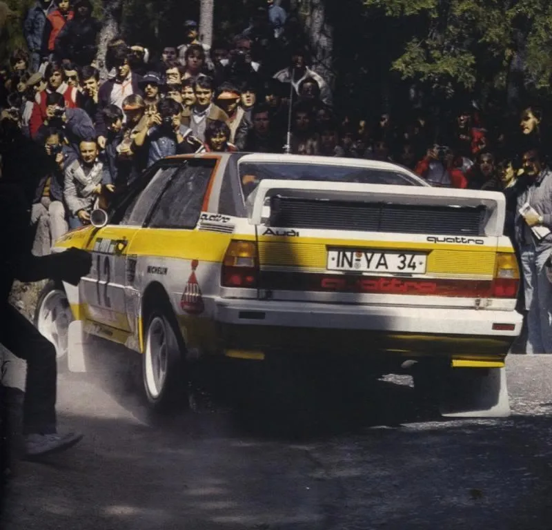

Rohrl and the growing crowds, Portugal '84

And the winner, Mikkola

No Audi Group B Quattro ever won the Safari Rally, in fact no 4WD Group B car
ever won the Safari Rally. Here is Mouton in '84 after hitting a vulture!

Tour de Corse 1984, as you can see from this photo, this was the debut event for
the Sport Quattro, Rohrl tried a sole SWB car.

Audi wanted a good result in Corsica, so much so that they gave multiple Tour de
Corse winner Bernard Darniche a car to run in the 1984 French Rally
Championship, here he is in Corsica, he retired after an accident.

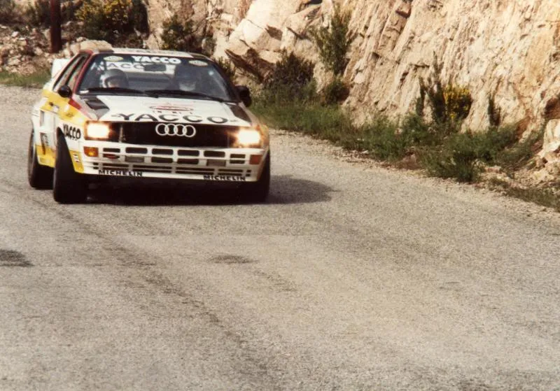

Blomqvist continued to drive the A2 for most of 1984, here he is taking a win in
Greece. He followed this with wins in New Zealand and Argentina, back in 1984
this was the first time any driver had won three WRC events in succession.

Mikkola took an A2 to second on the RAC, but by now the car was outdated and
already the Sport offered a reliable 400+bhp.....

---

The Audi Quattro Sport, some just know it as the short-wheelbase Quattro. Unlike
all the other true 4WD Group B supercars, the Sport was based on a real car, in
other words it didn't have a spaceframe chassis or mid-engine layout, this was
one of its weak points in many ways. Audi cut 320mm from the Quattro wheelbase
to create the Sport, allegedly the idea was to reduce weight and make the car
handle better on tarmac stages, for some reason it turned out to be the heaviest
Quattro to date, weighing in at 1200kg.

Here is a photo of the A1 Quattro in the foreground and the Sport directly
behind it, note not only the shorter appearance of the Sport, but also the much
sharper rake windscreen, apparently this was requested by the rally divers at
the time, as the original Quattro suffered badly from the sun's glare at certain
times of day (the two cars in the background are prototype mules)

The car made its WRC debut on the 1984 Tour de Corse, Walter Rohrl retired the
car after just 7 stages with overheating problems, also the car handled badly,
the Quattro was always a nose heavy car due to the engine being sat so far
forward, the short-wheelbase just seemed to make the problem worse. One good
thing about the car was its fabulous 20 valve engine, it was producing
comfortably over 400bhp, by 1985 it would be producing around 510bhp, probably
making it the first rally car with over 500bhp, 4WD had now made it possible for
rally cars to have the sort of power that F1 cars had enjoyed just a few years
previous.

Rohrl 1984 Tour de Corse

Three weeks later was the Acropolis Rally, Audi entered four works cars, Rohrl
and Mouton both ran the new Sport, while Mikkola and Blomqvist ran a trusty A2
each. The Sport Quattro started overheating as soon as the day became hot, Rohrl
was driving with his heater on, whilst having to back off when the oil
temperature got too hot. Despite these problems, Rohrl grabbed the lead by the
end of the first day, it didn't last though, electrical trouble struck on the
first stage of day two, eventually the car stopped with clutch failure.

Rohrl 1984 Acropolis

At the end of July 1984, Rohrl made his one and only appearance for Audi on the
British Rally Championship, the Ulster Rally in Northern Ireland, he was up
against the Opel Manta 400s of Jimmy McRae and Russell Brookes, although the
Opel was only producing about 275bhp it had often beaten the Quattros in
previous British tarmac rallies. Rohrl sent co driver Geistdorfer over to Ulster
prior to the event to make pace notes (this was unusual, as most drivers like to
call the notes to co drivers during a low speed pass of each stage, Rohrl tended
to do as he pleased, such was his talent, he arrived shortly before the rally
and drove once over each stage which would be run in darkness) Although the car
was difficult to drive, it turned out to be a demonstration of brutal power and
sheer skill by Rohrl, he took victory by well over four minutes.

Blomqvist clung on to his beloved A2 for as much of the '84 season as possible,
here he is making his Sport debut in Sanremo, an oil pipe let go after a hard
impact and Stig was out.

Blomqvist needed a few points to be sure of the 1984 drivers title, so he was
sent to the Ivory Coast Rally, only six cars finished this gruelling African
rally, it turned out to be the one and only win for the Sport in the WRC,
Blomqvist taking the win and the drivers crown.

1985, the traditional start to the WRC, the Monte Carlo, Rohrl put up a fight
against the 205 T16 of Vatanen, but the little mid engined Peugeot was too good,
Rohrl settling for second.

Blomqvist finished a massive 14 minutes behind Rohrl in fourth position.

Round 2 in Sweden, same result, Vatanen's 205 taking the win, with Blomqvist in
second, Stig said the car was just not comfortable in the corners. He once even
commented that a better combination might have been the 20 valve Sport engine in
an A2!

Portugal followed, Vatanen retired with suspension damage, this was Rohrl's
chance, he set 23 fastest stage times.

But it was not to be, he suffered a broken transmission casing on the notorious
35 mile Arganil stage, the car was fixed but too much time lost.

Blomqvist had a bad rally also, he finished fourth behind Rohrl in third, this
time Salonen won in...... a 205 T16, Audi were starting to plan their next move,
but in the meantime, the drivers would make do with this awesomely powerful, yet
difficult car.

Blomqvist Portugal '85

Audi sent two cars to the Safari, Stig and Hannu both retired.

Blomqvist on the '85 Safari. Have you ever noticed on those Hollywood films,
when a helicopter takes off and everyone runs for cover as dust blows
everywhere, of course that doesn't happen in reality.....

.....Well, not usually!!

Stig Blomqvist taking second on the '85 Acropolis.

Michele Mouton took part in the Pikes Peak Hillclimb in 1985, she and co driver
Fabrizia Pons had won the rally car class in 1984 driving a Sport, for 1985
Michele decided to go it alone.

She won the event and took the hill record with a time of 11 minutes 25.39
seconds.

Blomqvist '85 New Zealand

The final factory WRC outing for the Sport came on the 1985 Ivory Coast Rally,
Mouton had been entered in the hope of retaining her A priority status as a
rally driver, to do this she needed a top three finish, the rally was a total
disaster for the team, Mouton's co driver was taken ill during practice, so
Mikkola's co driver Arne Hertz was brought in, they hit a train during practice!
The rally went no better and she retired, this was her last rally for Audi, a
sad way to end.

Hannu Mikkola used a David Sutton run Sport on the 1986 British Rally
Championship, here he is on his way to victory during the Welsh Rally.

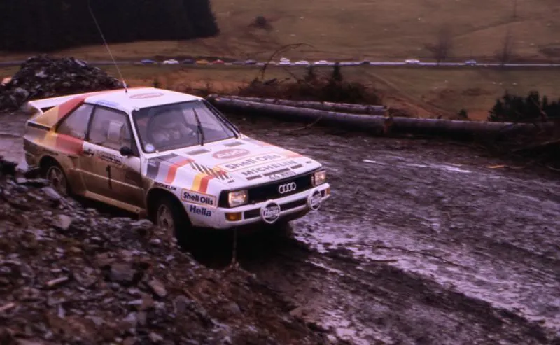

So, the Sport was heavy, didn't handle too well on the stages, wasn't loved by
any of the factory drivers as a rally car and was often unreliable. Did
spectators like watching that car on the stages? - Yes. Would I have a road
going Sport in my dream garage? - Yes. So, I guess Audi must have got something
right.

For the final chapter in Audi's Group B story, they would need something very
evolutionary if they were going to make this short Quattro capable of taking on
Peugeot.......

---

The Audi Quattro S1 E2, quite possibly the most memorable of all Group B
supercars, due to its outlandish use of aerodynamic wings and that glorious 5
cylinder noise.

Audi knew they had to improve weight distribution if they were to take on the
Peugeot 205 T16. They did this in main by moving the oil coolers and radiators
to the rear of the car. Moving the radiators proved to be a very good move on
the part of Audi, because they were able to gain FIA approval for their large
rear wing by using the reason that it was (partly) for cooling purposes. Peugeot
apparently also wanted a much more extreme rear wing but were turned down.

The car made a somewhat low key debut on the 1985 Olympus Rally in North
America. Thanks to Lance in Seattle (I'm sure many of you will know Lance for
the great M3 DVDs he has put together), I have these never seen before photos of
the S1 E2, Lance tells me that you could count the spectators on that Olympus
Rally, only a few people were aware what an extraordinary debut they were
witnessing. It must have been like a spacecraft landing, just look how crude the
other cars look next to the winged wonder.

Hannu Mikkola drove the car.

The car made its WRC debut a few weeks later in Argentina, Stig Blomqvist showed
the car was competitive with a number of fastest times, but retired with engine
problems.

No matter what angle you saw it from, the E2 looked totally purposeful.

The bodywork always looked more suited to a racing circuit rather than a gravel
rally stage.

Blomqvist soon showed this was very true!

One thing the Audi engineers perhaps overlooked was sufficient cooling for the
brakes, they introduced a water cooled braking system, this was very effective
on shorter stages but on longer stages it required a lot of water!!

Blomqvist - Finland 1985

The drivers did comment how well the car flew, due to the well sorted aero
package

It didn't stop drivers pushing beyond the limit though

Roland Gumpert and his men get busy. Blomqvist finished second in Finland to the
Peugeot of Salonen.

It was going to take a machine like driver to get the absolute best out of this
car, a certain German driver was preparing himself in the Italian countryside
for his S1 E2 WRC debut:

<video src="../img/XrhcSRktAs0.mp4" controls></video>

---

The 1985 Sanremo Rally was due to be the debut event for the Lancia Delta S4,
but much to the frustration of the Italian fans, the car was yet again delayed.
So, the Peugeot 205 T16 E2 would clean up again right? Well, Audi had other
ideas, Walter Röhrl had spent some time setting his car up.

The rally was run over 43 special stages, 13 stages were to be run on the tarmac
roads in the mountains behind Sanremo and another 30 stages would be held on the
gravel roads of Tuscany.

The spectators in Italy were crazy, probably almost as crazy as the fans in
Portugal. Röhrl set off flat out over the opening tarmac stages, swapping times
with the Peugeot of Frenchman Bruno Saby.

Röhrl said in an interview many years later that the Audi he drove on that
Sanremo Rally was producing 535bhp, which he described as 'Plenty of power
everywhere and at any speed'

Röhrl's co driver Christian Geistdörfer once compared being driven flat out in a
Group B car to having your brain shook loose, this rally must have been the most
extreme demonstration ever of that feeling!

'Once the car exceeded 60mph the aerodynamics of the car worked really well,
giving good downforce. The engine gave full power above 3000rpm, if you lifted
off the right pedal then you lost all power, it was all or nothing and I went
for all on that 1985 Sanremo' \
\- Walter Röhrl

Röhrl totally made the event his own, setting 29 fastest stage times, he
demolished the opposition, winning the event by six and a half minutes from Timo
Salonen's Peugeot. It is still remembered to this day as one of the greatest WRC
wins.

Last event of 1985 was the RAC Rally of Great Britain, a pair of S1 E2 Quattros
were entered, Röhrl was running a very early semi automatic gearbox which was
operated by a foot switch (Remember this was high tech back in 1985, it was well
into the 1990s before F1 cars had paddle gearshifts)

Englishman Phil Short was chosen to sit next to Röhrl, Short remembers it as one
of the biggest accidents of his career, the pair ended up rolling down a
hillside in Wales, just about every panel came off the car! When they finally
came to rest (on the wheels) Röhrl still had his hands on the steering wheel, he
turned to Short and said 'I think our rally is over!'

Walter Röhrl and Phil Short on the 1985 RAC Rally (Before their big off)

Hannu Mikkola had finished first or second on every RAC Rally since 1979, sadly
1985 brought this to an end, retirement came after an electronics problem.

Mikkola on a spectator stage during the 1985 RAC Rally.

1985 had seen Audi turn it's car back into a competitive rally car, satisfying
work for all involved I'm sure, 1986 would offer the greatest battle the WRC had
ever seen, Lancia now had a car which won straight out of the box, Peugeot were
still a major force, even Britain now had a rally supercar with the MG 6R4, the
1986 Monte Carlo Rally was a mouth watering prospect for rally fans - Could the
Monte meister Walter Röhrl regain his crown.....

---

Walter Röhrl preparing for the start of the 1986 Monte Carlo Rally, they didn't
know it then, but this was to be the last time that the Group B supercars would
ever be driven on the Monte Carlo stages.

The early stages were all run on snow, Röhrl showed his usual flair.

The Monte had been a popular spectator event for years, but the development of
the Group B cars meant the crowds were bigger than ever.

Hannu Mikkola was also present in a second Quattro, he paid Röhrl and the Audi
team (who had together fine tuned the car for this event) a huge compliment when
he described the S1 E2 as the best car he had ever driven on tarmac, day two of
the event brought a chance to put that to use as the stages were fairly much
clear from Snow and ice.

The man and the machine - Inside the cockpit of the mighty Group B Audi

Henri Toivonen had been leading the event but then had a huge road accident,
Toivonen kept going but this was Röhrl's chance, he was probably the only driver
who had the confidence and ability to take on Toivonen in this event, it all
went wrong for the German though, he had a rear puncture which forced him to
stop and change the wheel, only to find the spare was a studded tyre and this
was a dry tarmac stage!!

A second puncture followed, Walter had to settle for fourth place, ten minutes
down on the winner.

Mikkola brought the sister car home in third, here we can see that the 'cow
catcher' front wing was not made from solid granite after all.

Next event for the Audi team was the Rally of Portugal, a single entry was made
for Röhrl

The cars set off for the now notorious Sintra stages, for years these stages had
attracted huge uncontrolled crowds, 1986 was to see the biggest crowds yet, not
since the days of the classic road races such as Targa Florio and Mille Miglia
had such powerful cars been driven between walls of spectators.

A rare photo of a car on the '86 Rally of Portugal without huge crowds

The accident many had feared didn't take long to happen, local driver Joaquim
Santos lost control of his RS200 when avoiding spectators in the road, this
caused him to leave the road, killing three spectators and injuring many more,
it was a black day in the history of rallying.

All the major teams withdrew from the event after just three special stages.
This was to be the very last time we would see the amazing winged wonder on the
WRC stages, Audi decided to withdraw from international rallying with their
Group B cars with immediate effect. We will probably never see or hear a car
like this ever again in international rallying.

---

The Peugeot 205 Turbo 16, this was the rally car that took all the best
ingredients and mixed them perfectly together - 4 wheel drive, turbo charging,
space frame technology, mid-engine layout, all in a lightweight (940kg) package.

The car was originally tested in 1983, here is the T16 being rolled out for the
first time.

The 205 T16 story started in 1981 when Jean Boillot, the head of Automobiles
Peugeot asked professional co driver Jean Todt to help create a competition
department for PSA Peugeot Citroën.

By 1983 they had a car up and running, the photo below shows from the left, Jean
Boillot, Jean Todt and Jean-Pierre Nicolas. Boillot was the son of famous pre
WW1 Grand Prix driver Georges Boillot who was the first two time winner of the
French Grand Prix in 1912 & 1913 driving a Peugeot, of course!!

A quiet test session followed at a French rallysprint! Jean-Pierre Nicolas had
retired from rallying at the end of 1980 after a career which had seen him win
five WRC events, but he was tempted back to develop the T16.

May 1984 would see the WRC debut of the car, here are the team arriving on the
island of Corsica for the all tarmac Tour de Corse.

The main competition would come in the shape of the Lancia 037 team, who had won
here in 1983

Vatanen diced with Bettega's Lancia for the first few stages, the 205 was
immediately comfortable on tarmac, something the Quattro never had been.

The T16 was the first car since the Lancia Stratos to use fully removable
bodywork, it made servicing so much easier, here is the second 205 of Nicolas
during a service interval.

Anyone who watched rallying in the UK during the early / mid 1980s will remember
that the Opel Manta 400 could reasonably hold it's own against the more powerful
Quattro on tarmac events, Peugeot had cleverly designed the T16 with three
options for transmission torque split - 50/50 for very slippery surfaces, 33/67
for gravel and 25/75 for tarmac.

Not only was the 205 faster than the Opel, it was able to catch the works car of
Guy Frequelin during the stages...

...and actually pass it!

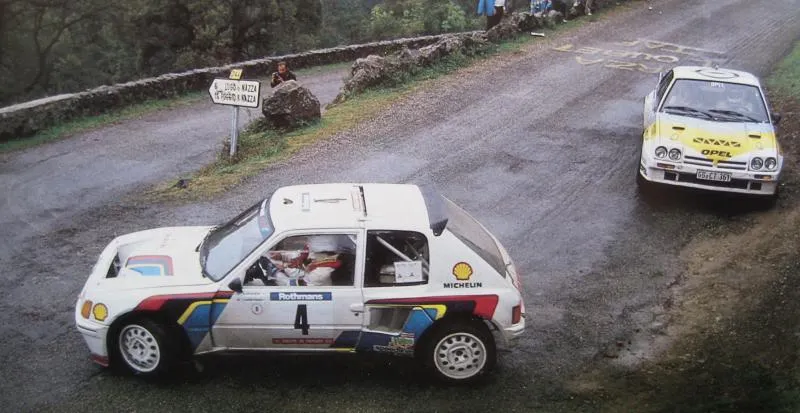

Vatanen was the sensation of the rally, he grabbed the lead on stage 8 and held
it until crashing on stage 19, this was forgiven by the team, he had proved the
car had pace.

The sister car of Jean-Pierre Nicolas kept going...

...and finished a solid fourth overall, not to bad for a driver who had been
retired since 1980.

Next event was the super tough Acropolis Rally, Vatanen set 11 fastest times but
retired with an engine problem, the team went back to their Paris HQ to regroup.

Finland's 1000 Lakes rally, the fastest rally on the WRC and an event that
Vatanen had won in 1981, Ari dearly wanted another win on his home event, and he
did it in style, the T16 totally dominated.

Winner Vatanen flanked by Henri Toivonen and Markku Alen

With co driver Terry Harryman, Vatanen always celebrated a win with a glass of
milk (He also enjoyed milk as a sponsor many times over the years) Look closely
and you can see Harryman clutching an unopened bottle of champagne, which I'm
sure he enjoyed later :craze:

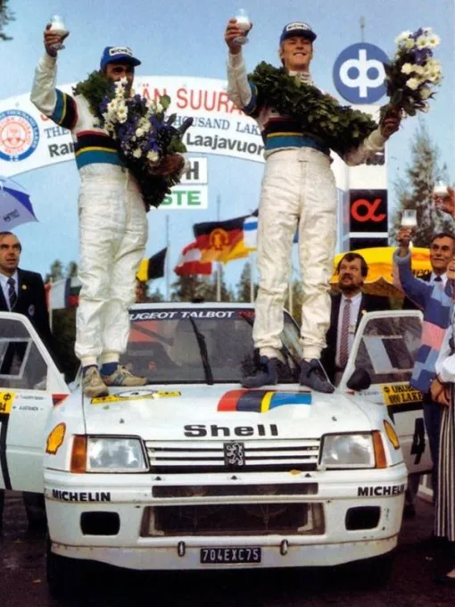

One month later the cars arrived in Italy for the Sanremo Rally, it would be
another demonstration in how to go rallying from Peugeot, Vatanen taking another
crushing win.

Mechanics work on Ari's car during the Sanremo

British rally fans (including myself) could barely wait for the amazing 205 to
arrive for final round of the 1984 WRC, the RAC Rally.

Ari built up a massive lead over the Audi of Mikkola

He gave everybody a scare when he rolled his car and lost the several minute
lead he had built up. Here is Ari helping to replace the windscreen!

Mikkola's Quattro nearly kept Ari honest, but in the end Vatanen won by less
that a minute - Another glass of milk.

Three wins from the last three starts, surely Vatanen had to be clear favourite
to win the 1985 WRC drivers title...

---

The start of the 1985 World Rally Championship season, Peugeot had some new team
members. Posing prior to the start of the Monte Carlo Rally, from the left Terry
Harryman, Ari Vatanen, Timo Salonen, Seppo Harjanne, Bruno Saby, Jean-Francois
Fauchille and Jean Todt.

A French team on France's premier rally, the pressure on Vatanen to win was
massive, he set fastest time on the first stage, but on stage two it all went
slightly wrong when Ari hit some spectators, luckily nobody was seriously
injured but it shook Vatanen and it took him until stage nine to regain the lead
from Röhrl's Audi.

Peugeot servicing, back then there was an enormous range of tyres available, so
much so that Michelin had told Audi to only enter two cars on the event, such
was their commitment to the Peugeot team.

Vatanen got back in the groove, setting a string of fastest times, this was Ari
at his peak.

Vatanen built up a good lead, it would now take a disaster to stop him from
winning, sure enough that's exactly what happened! co driver Terry Harryman
failed to spot an error on a time card and ended up booking into a time control
wrongly, the pair took an eight minute penalty.

What followed was Vatanen driving at the absolute limit

Ari's job was made easier by Röhrl making a wrong tyre choice, in the end the
205 won by over five minutes, but it could have been quite different, I bet
there were some tense moments in the car after the time card error.

It was happy days back in Monaco harbour, this was the first time Röhrl had been
defeated on the Monte since 1979.

New team member Salonen came in third overall (His first rally in a 4WD car)
Salonen, Vatanen and Röhrl celebrate.

This time Harryman put the milk down and opened the champagne, I bet he was
ready for a drink after all that excitement!

Two weeks later Vatanen scored another win in Sweden

This made five consecutive wins for Vatanen and Peugeot, nobody had achieved
such success on the World Rally Championship before. It would have been
impossible to believe back then, and it still seems impossible today to believe,
but this was to be Vatanen's last ever win on the WRC.

---

Just going back to Vatanen's Monte spectator moment - I knew I had some photos
somewhere, as I said previously, nobody seriously hurt, but another timely
reminder of how popular rallying had become.

---

Round 3 of the 1985 WRC took the teams to Portugal, Vatanen set off relatively
cautiously, due to the fact that the T16 was still an unknown performer on
really rough roads, would it hold up?

Huge crowds as always turned out in Portugal

Inside the cockpit of the Group B 205

Ari had a puncture on a stage, he drove to the end and thought he'd got away
with it, but on one of the following stages the suspension failed and Vatanen's
incredible run of WRC wins was at an end.

Walter Röhrl's Audi was starting to dominate the event, Röhrl commented that you
had to hate everything about cars to drive fast on the gravel roads in Portugal,
they were so rough. Vatanen's team mate Timo Salonen was trying to chase the
Audi down.

You can see from this photo how rocky the roads were

Röhrl hit problems late in the event and dropped to fourth, allowing Salonen
through to take his first win for Peugeot

Although Vatanen and Salonen both came from Finland, you couldn't get more
opposites. Ari, as we know, was super fit and never touched alcohol, and god
forbid, he certainly never touched cigarettes!

Salonen on the other hand was overweight and a chain smoker so he was never
going to be world champion, was he? He now led Vatanen in the championship by 4
points!

The T16's front end was dominated by a large radiator and cooling fans, highly
effective

Next up was a specialist event - The Safari Rally in Kenya

African spectators showing their enthusiasm for rallying!

Salonen was the only supercar driver to make the finish, he came home a lowly
seventh overall, after over 3000 miles of driving some of the worlds toughest
roads the 205 looked much the worse for wear

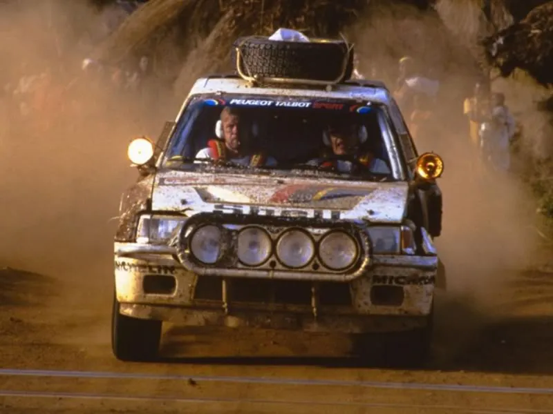

Complete contrast came just a few weeks later when the cars arrived in Corsica
for the only true all tarmac round, this would be the first time the T16 would
start an event for a second time, having made it's debut here in 1984.

Tour de Corse driver line up for '85, Bruno Saby joining Vatanen and Salonen

Also significant was this event marked the debut of the 205 T16 E2, this
evolution car had 450bhp vs. the 350bhp of the original model, it also tipped
the scales at 910kg, slightly less than the original. Saby drove the only E2 in
Corsica, the Finns opting to stay with the tried and tested original.

This photo of the E2 clearly shows where the term 'mid engined' supercar comes
from

Salonen's luck ran out, he didn't even complete the first stage following an
electrical problem, so much for using the tried and tested model!

Vatanen had a double puncture early on and set about playing catch up as only
Ari could, it all ended in a big accident, Vatanen himself admitting that it
really scared him, other drivers following Ari in the stages said they were not
surprised after seeing the tyre marks he had been laying down at each corner.
Thankfully the roll cage did it's job, but it was a very big shunt. Saby brought
the remaining car home in second behind Ragnotti's Renault after being told to
hold position and collect some points for the manufacturers title, which Peugeot
now led by 30 points over Audi.

The Acropolis Rally turned out to be another disaster for Ari, this is a rare
photo of him from that event, he retired with broken steering on the second
stage. Team mate Salonen took another win.

---

Salonen and Vatanen went on to finish 1-2 respectively in New Zealand, and as
the cars arrived in Argentina for the South American round of the World Rally
Championship Timo led Ari by 33 points. Vatanen would be on the attack.

Salonen on one of the distinctive stages in Argentina, Peugeot chose to send
three original T16 models to Argentina, this had worked well in New Zealand.

Peugeot had entered three cars in Argentina, the third car was to be driven by a
local superstar, Carlos Reutemann had enjoyed a glittering career as a Formula 1
driver for Brabham, Lotus, Ferrari and Williams, in which he won 12 Grand Prix.

Jean Todt and Carlos Reutemann

Reutemann at speed on one of the stages, the 205 T16 supposedly had a habit of
occasionally kicking the back end up on high speed bumpy sections

Vatanen was fastest on the first stage, but on the second stage it all went
horribly wrong for Ari when he suffered one of the biggest accidents of his
career

The accident happened on a quick and slightly downhill section of the stage, in
the weeks leading up to the event it had been raining, the stage had dried out
apart from a wet muddy patch under some trees, a dip in the patch caused the 205
to roll end over end. Spectators who had been at the scene reported that Salonen
who had passed through earlier, backed off slightly but Ari hit the dip flat
out.

Despite the rollcage having apparently kept the cockpit in good shape during the
accident, Vatanen suffered horrific injuries, had it not been for the Peugeot
helicopter finding the crash scene, it is quite likely the Ari would have died,
the team used the sump guard (which had been ripped from under the car in the
crash) as a stretcher. Vatanen wrote in his book that he felt his seat had
broken away from it's mounting points during the crash, and that was what caused
him to be so badly injured.

Salonen took the win in Argentina, Reutemann came home in third, the only F1
driver ever to take a podium on a WRC event.

Finland, round 9 of 12, Salonen gave the E2 it's loose surface debut, and with
it a popular home win. This win also gave Salonen the World drivers title and
Peugeot the manufacturers title, such was the dominance of the French supercar.

So, the overweight, chain smoking driver with the thick glasses became World
Champion, here he is with co driver Seppo Harjanne, the pairing had spent the
previous six seasons driving for Datsun/Nissan in uncompetitive cars, although
Salonen was reputed to be the highest paid rally driver in the world back in the
early 1980s with Datsun, finally he had a car which was up to the job and he had
delivered. Seppo Harjanne also enjoyed success with Tommi Makinen, taking the
world title in 1996 and 1997 before retiring.

Peugeot had a fairly low key end to 1985, Salonen was soundly thrashed by Walter
Röhrl in the Audi on the Sanremo. All the factory T16s retired from the '85 RAC
Rally.

One last photo from the 1985 RAC Rally, this particular photo brings back good
memories for me, it was taken at the Olivers Mount motorcycle racing circuit in
Scarborough. Finland's Mikael Sundström had been chosen by Peugeot Talbot UK to
drive an original T16, here he is holding up eventual winner Henri Toivonen,
Sundström refused to let Toivonen pass him, Toivonen was furious but it made
pure theatre for the spectators that day - I know, because I was one of them.

Peugeot had enjoyed a dominant 1985 season, 1986 promised to be much more
competitive, Lancia had taken a 1-2 with it's new Delta S4 on the RAC Rally.

---

The 1986 Monte Carlo Rally, Peugeot entered three cars for drivers Salonen,
Bruno Saby and their new signing Juha Kankkunen.

Kankkunen soon got to grips with the 205, this was his first event in a 4WD car,
he finished a solid 5th overall

Bruno Saby had high hopes of winning the Monte, but things didn't go too well
for him, despite this damage he managed to finish 6th

Peugeot Germany had also entered a T16 for Michele Mouton, she retired with
mechanical trouble

It was left to Salonen to bring the points home, he finished 2nd.

Next rally was the Swedish, Kankkunen took his first win for the French team.

Round 3 - Portugal

Kankkunen blasts his way through a wall of out of control spectators

Salonen and a cameraman had a moment of contact, both the camera and the car
came out somewhat second hand!

Spectators scavenged what they could from the rear cover of Salonen's car

It was all over after three stages, when all the major teams withdrew following
the spectator problems.

The Safari was a rally that had never been won by a four wheel drive car,
Peugeot had gone to great lengths to ensure they would be the first to do so,
they had 1985 winner Kankkunen driving for them and also Kenyan Safari master
Shekhar Mehta.

Mehta had won the Safari five times, including four back to back wins between
1979 - 1982 (Many would have considered such a record impossible on what was the
toughest event on the WRC calender)

During practice for the Safari, Mehta showed just how well Group B cars burned!

The Safari rally was unique back then, in the fact that that it was run on open
public roads, this meant that teams were free to run support vehicles on the
rally, this chase car would have been used to donate parts to Kankkunen or
Mehta, should they have hit trouble, looks like he might have been carrying a
spare radiator on the roof, not much carrying capacity inside a Group B car!

Kankkunen finished best Peugeot and best 4WD car in 5th position, soundly beaten
by the Toyota Celica Turbo (The same car he had won the Safari Rally in just a
year earlier)

Next was Corsica, Saby sets out on what he hopes will be his first win in the
205.

Peugeot had given a full factory Evolution 2 version to Michele Mouton, this was
to be her very last appearance on the WRC

Michele had carved her WRC reputation in Corsica, she had recorded five top 10
finishes on the rally before she joined Audi in 1981. She set some quick times
but retired with gearbox problems, a sad end to her WRC career.

Service during the '86 Tour de Corse, the cars of Salonen, Saby and Mouton can
be seen

Salonen retired, but Saby went on to win the event in car number 5, it was
however a very sombre victory

Kankkunen won the next round in Greece, he now had a healthy lead in the
championship, as did Peugeot.

New Zealand, Salonen in full flight.

But it was team-mate Kankkunen who won the event, this man was unstoppable on
loose suface events.

The sight of a Group B car at full chat was a sight to behold

---

Peugeot only managed to finish 3rd in Argentina, but they were still heading
towards another world title.

Finland - Stig Blomqvist had been brought into the Peugeot squad to ensure they
gained some solid manufacurers points in Finland (Ford had decided to scale
their season down, so released Blomqvist temporarily) Stig came home in 4th.

Finland was (and still is) the fastest rally on the WRC, the 1986 event would
see the most powerful cars ever take to the start ramp, this would be a diplay
of skill and bravery over the endless high speed jumps, at the end it was Timo
Salonen who took the win over team mate Kankkunen. This result gave Peugeot the
1986 world manufacturers title.

Timo during a service halt, with the obligatory Salonen cigarette! Winner of the
fastest WRC round, driving the most powerful Group B car the French team had
ever fielded, remember that these cars had no power steering, and the phrase
'driver aids' hadn't been invented!! They were brutal machines that took
incredible driver input to get the best from.

Italy, the Sanremo Rally saw a very popular driver back behind the wheel, Ari
Vatanen drove the zero course car, he had been out of the sport for well over a
year, following that horrific crash in Argentina. Look at the rear of the car on
this photo, he had lost none of his flair for inficting damage on rally cars :-)

Italian pride was at stake, the Lancia team did not want to beaten in this
historical final meeting of Group B cars on Italian soil, they had a major
problem though, the Peugeot was a superior rally car.

Peugeot were running 3-bar boost and their cars were producing at least 540bhp
(something which Lancia could not match)

Kankkunen had taken the lead early on in the event, Lancia had no answer.

All the Peugeots were excluded at the beginning of the fourth day, the reason
was that the 205s were running illegal skirts (seee pic below) It was hard to
see how these skirts gave any significant advantage, this was the most
sensational rally exclusion since the Minis were thrown out of the 1966 Monte
Carlo rally.

Next round was the RAC Rally of Great Britain, this would be the very last time
that all the major teams would attend a world rally with their Group B cars.

Salonen's car at service, just lok at those fuel prices, unleaded wasn't even
heard of back then.

It was a wet but mild event, Kankkunen finished 3rd, but significantly Markku
Alen's Lancia was second, this meant that Alen now had a one point lead in the
drivers championship (Although this was very provisional due to the disputed
Sanremo result)

Kankkunen

The winner of the 1986 RAC - Tmo Salonen, a fine way to sign off his Group B
career.

Traditionally the RAC had always been the final round of the WRC, but in 1986
there was a new round in the USA. The Olympus Rally was based close to Seattle
in Washington State. Due to the fact that the championship was in dispute,
Peugoet and Lancia had no choice but to send a car each for Kankkunen and Alen.

Drivers pose at the Tacoma Dome prior to to start

The factory 205 of Kankkunen next to the privately run 205 T16 of American
driver Jon Woodner

Kankkunen made a good start, trading times with Alen

Service at the local high school, note the James Bond front plate to allow jack
access!

Kankkunen lost the lead when he had to change a battery, Alen took the lead and
never lost it. Theoretically, this made Alen World Champion, but the FIA courts
would have to decide that.

While Peugeot waited for the fate of the world drivers championship to be
decided, some good news from Germany, Michele Mouton became West German Rally
Champion, this was the point that Mouton retired from competitive driving, so in
the end she went out in style.

---

The Lancia Delta S4. This car was unique in the fact that it used a supercharger
and a turbocharger, the idea being that the supercharger supplied instant
response and the turbo provided the serious power, it also gave the car a unique
sound.

The S4 was badly delayed, the car showed poor reliability in testing, so when it
finally made it's debut on the 1985 RAC Rally, it was intended to be just a test
for the 1986 season.

Markku Alen did all the testing prior to the RAC, it paid off as he went
straight into the lead.

'Maximum attack' - A phrase which Markku Alen coined, it summed up his style
perfectly. He held the lead up until stage 12 when Mikkola took over in the
Audi.

Alen re-took the lead on stage 21 when Mikkola hit problems. The 1985 event was
turning into a wintry affair, for 3 days the temperature never rose above
freezing, studded tyres were outlawed on the British event.

It was a hell of a test controlling a group B car with 450bhp on those roads,
traction control was strictly ruled by the drivers right foot!

Alen at Olivers Mount in Scarborough, he had what he described as the biggest
spin of his career here, back then the event was a secret route rally, so there
were no pace notes, co-drivers could only use maps and their knowledge from
memory.

Henri Toivonen was Lancia's second driver on the event, he had set off
cautiously, due to the fact that he had hardly so much as sat in the car prior
to the start.

Alen went off the road late in the event, this allowed Toivonen through to take
the win, with Markku recovering to take second place, this was a dream start to
the S4's competition life, a 1-2 finish on the gruelling RAC Rally which in 1985
was held over 63 stages and 547 miles of flat out driving.

Toivonen had not won a world rally for five years, he was super fast but
sometimes a risk taker in the same way Ari Vatanen was, and later Colin McRae
would become, this trait would be very useful for getting the best from the S4
as it was a very difficult car to drive.

Next outing for the S4 was the 1986 Monte Carlo Rally, Henri took the lead
immediately, he was the only Lancia driver who could take on the Peugeots.

Toivonen was flying

But then it all went badly wrong, Toivonen hit a non-competing car on a road
section, as you can see from this photo it was a big impact.

The team got to work repairing the mangled wreckage

Miki Biasion in car number 9

Markku Alen was his usual flamboyant self on all surfaces

Toivonen had amazingly got going and was back on the attack, this photo
highlights just how difficult it is for drivers to choose the correct tyres on
the Monte, stages can start off as snow covered roads and then change to dry
roads.

Toivonen's car was bent like a banana (and would have certainly handled like
one), he overcame the odds to take a victory that is still fondly remembered
today

Henri Toivonen and Sergio Cresto celebrate victory in Monaco harbour

Three weeks later Toivonen was leading the Swedish Rally (Incredible,
considering that this was Henri's first Swedish Rally!) but he was sidelined
with a seized engine.

---

Rallye de Portugal. Group B cars attracted spectators wherever they went...

...but in Portugal, the sport had become perhaps too popular for it's own good

Toivonen was equal fastest on stage 1

Alen was on the attack, he was somewhat of a specialist in Portugal, having won
the event four times

By stage 3 Biasion had taken the lead, but it was all in vain, the top teams all
withdrew from the event

Lancia decided not to take the S4 to the Safari Rally, instead they dusted off
the 037 in which Alen finished 3rd.

The all tarmac Tour de Corse, Lancia entered three cars for Alen, Biasion and
Toivonen.

A quiet moment before the off, Markku Alen watches on as co-driver Ilkka
Kivimaki fuels up

Toivonen at the start, Sergio Cresto walks ahead of car number 4

The Peugeots were quickest over the first few stages, then Toivonen started to
get a feel for the S4, he began setting one fastest stage time after another

Car number 1 - Alen

Toivonen was thrilling the crowds with his mastery of the hard to drive Lancia

Roadside service always gave spectators an extra chance to see the cars and
drivers up close

The g-forces that drivers and co-drivers were now experiencing were far greater
than any rally drivers had ever seen

Alen shares a moment with Toivonen at a service halt. Sadly, this may have been
the last time the two drivers ever spoke to one another...

Toivonen set a stage time a staggering 47 seconds faster than the 205 of Bruno
Saby, this now meant that Henri had a lead of 2 minutes 45 seconds, the event
was surely his

What happened next shook the world of motorsport to the very core, Toivonen's
car left the road on a left hand bend, it flipped in the air, hit some trees and
exploded, the fire that followed was so severe that it melted the engine block,
in fact all that was left was a part of the spaceframe. Toivonen and Cresto were
dead.

Motorsports governing body FISA (as it was known then) immediately announced
that Group B would be replaced by Group A for 1987, Group B would however be
able to continue for the remainder of the 1986 season.

As a mark of respect, the number 4 was not seen on a car during the Tour de
Corse for many years.

Thanks Henri.

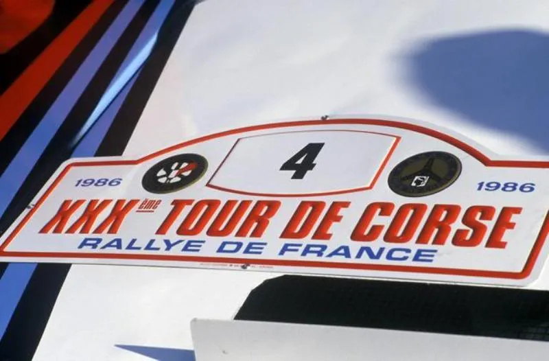

---

The next round following Toivonen's death was the Acropolis Rally, the mood in
the Lancia team must have been pretty low, they had lost the one driver who
seemed capable of fully mastering the S4. You can only imagine what must have
been going through all the Group B drivers minds, would they survive the season,
what if they went off, would their car go up in flames, all of a sudden it was
like being an F1 driver in the 1960s or '70s.

Alen was pushing Kankkunen by the end of the rally, he gave the team the
instruction to turn the boost right up on his car, the S4 retired with an
expired engine.

New Zealand, always popular with the drivers, some of the nicest rally roads in
the world.

Alen at speed

Alen had the fright of his life in New Zealand, every drivers worst nightmare is
finding a non-competing car coming towards you on what is supposed to be a
closed road, the problem when organising rallies is making sure everybody who
lives on the edge of the stages is aware that the road is closed. This forest
vehicle obviously hadn't got the message, thankfully no harm was done but it was
very close, it threw Alen completely and he dropped back from challenging
Kankkunen for the lead to finish a distant second.

South America, Rally Argentina.

Local driver Jorge Recalde sets off in front of an enthusiastic crowd, he
finished fourth with Alen second. Biasion took the win, a rare victory for the
S4

Finland, Alen already had a good win record on his home soil, he was always
quick out of the box and went straight into the lead

Markku held the lead until stage 34, but under pressure from the Peugeots of
Salonen and Kankkunen he went off, he recovered to finish third but this ended
Lancias challenge for the manufacturers title, Lancia really were missing
Toivonen.

I have already told the story of the Sanremo Rally in the Peugeot section of
this thread. Once they were free from the French team, Lancia were able to
shuffle their drivers around, this allowed Alen to take the win and take the
drivers title to the wire.

Alen

Biasion should have won, but when he had to take deliberate time penalties he
ended up third!

The RAC Rally, Alen finished second, beating his title rival Kankkunen into
third.

Lancia brought Swedish driver Mikael Ericsson into the team, he actually led the
rally on the third day but retired with engine failure.

It all went down to the final round in the USA

Alen's car at scrutineering

An early head to head battle with Kankkunen

Service during the event

Kankkunen had a minor problem with a battery, allowing Alen to win and take the
world drivers championship...

... Alen was world champion for 11 days! The govering body removed the Sanremo
results from the championship, thus relieving Markku of 20 points. Alen never
did win the world drivers title and he still remains to this day the most
successful WRC driver never to have won the title.

---

Austin Rover MG Metro 6R4

During 1981, British Leyland competitions manager John Davenport met with
Williams F1 to look at designing a car which would take on the all new Audi
Quattro, plans were laid to build a mid-engined 4 wheel drive rally car.
Initially, power came from a Rover V8 which had 2 cylinders chopped off to make
a V6 2.5 litre, with the use of some Rover Vitesse touring car internals, the
engine produced 250bhp. Tony Pond tested the first car in private at the
beginning of 1983.

Not until the beginning of 1984 did the car make its debut in front of the
public, Tony Pond ran the car on the York National Rally, after setting a string
of fastest stage times, the car retired with a minor fire, the car had shown it
had serious potential.

During 1984 the 6R4 started to use aerodynamic 'F1 style' wings (the first rally
car to do so) Here is Pond on the 1984 Mewla Rally.

Pond on the 1984 Audi National Rally, by now the aero package had moved to the
front of the car.

Marc Duez was also testing the car in Belgium

The 6R4 also made it onto prime time TV in the UK when ITV screened drama
programme 'The Winning Streak'

Back to the serious stuff. By 1985 an all new 3.0 litre purpose built V6 engine
was in place, this was not what Williams Grand Prix designer Patrick Head had
originally planned for the 6R4, he had wanted to run a compact, lightweight V6
2.5 litre unit in a car which he saw running 13 inch rims and a narrow track,
Michelin had already developed a new rally tyre for Audi and Peugeot which ran
on 15 inch rims, the 6R4 had to grow to accommodate.

200 units were built and duly homologated by the end of 1985, just in time for
the RAC Rally of Great Britain. Two factory cars were entered for Tony Pond and
Malcolm Wilson.

Wilson on a spectator stage

Pond got off to a cautious start, he had famously retired from the 1984 event
after hitting a tree on a spectator stage

Wilson initially set the pace over Pond but his car retired with engine trouble
before the halfway point of the event - 13 was definitely unlucky for him!

Pond got faster as the event progressed

The weather was bitterly cold during the 1985 rally, by the end of the event it
was a battle between the lone 6R4 of Tony Pond and the Lancia Delta S4s of Alen
and Toivonen. The British crowds really got behind the 6R4, cheering it along,
even on road sections, in the end Pond brought the car home in third overall, a
fine result for a world debut.

A British legend had been born

---

Austin Rover saw 1986 as a learning season, they had never done a full world
rally championship season before, so a lot of new events to take in.

Crowds gathered in Paris as the cars set out on the Monte Carlo Rally. Pond and
Wilson were again the drivers.

Wilson in Paris, prior to the start

Rallying was enjoying its biggest ever following, as can be seen from these
photos of Pond

Pond had an accident on a road section and he was out

Wilson lasted little longer, out with transmission problems

Wilson and Per Eklund took cars to Sweden but both went out with engine trouble,
Wilson did however set some top 3 stage times, showing the car had potential.

Portugal, this time there was a three car entry, Marc Duez joining Pond and
Wilson

The car of Duez, before the start of the rally

Wilson powers his way through the huge uncontrolled crowds

The rally was all but over after 3 stages, all the major teams withdrew
following a car going into the crowd, this story made the national news
headlines all over the world, Tony Pond was quite vocal in his opinion, he was
deinitely not prepared to go on driving in Portugal, Pond had previously
predicted that it was only a matter of time before a car went into spectators
somewhere in the world. Now it had finally happened.

Pond and Walter Röhrl face the worlds media

---

Corsica 1986 - Battle of the Group B giants

Austin Rover had entered three cars in Corsica for Pond, Wilson and up and
coming French driver Didier Auriol.

Auriol's car was prepared by British preparation comany R.E.D.

Auriol only completed stage 1, the photo says it all!

Pond was somewhat of a tarmac expert, not only that, he had compteted in Corsica
four times previously, finishing as high as 3rd overall in 1981. Being seeded at
3 Pond was ahead of Toivonen on the stages, such was the pace of Toivonen and
Lancia, they actually caught and passed Pond on some of the longer stages, it
was now highly apparent that the normally aspirated 6R4 was no match for the
turbo cars.

The Metro was suffering overheating problems on some rallies, looking at these
photos, Corsica may have been one of those events.

Malcolm Wilson was making his Corsican debut

All was not going well

Wilson retired on day one with an engine fire, Pond went out on day two with
cambelt failure (This turned out to be a weak point on the 6R4).

The factory cars stayed away from the Acropolis and New Zealand rallies.
However, a private 6R4 showed up in New Zealand, driven by local driver Tony
Teesdale, after delays he finished well down the field, but did record some
quick times.

Finland - Three cars entered for Wilson, Eklund and Harri Toivonen (Henri's
younger brother). Hopes were high after Wilson won the Mantta 200 Rally a few
weeks before, this was a Finnish national rally which was often used as a
shakedown for the 1000 Lakes, the win made Wilson the first non-Scandinavian to
win a rally on Finnish soil.

Wilson rolled his car on the first leg of the rally but kept going and finished
10th overall, much to the delight of the local spectators as Wilson drove his
heavily battered car on the stages, Toivonen was 8th and Eklund 7th, a good
solid event for the car considering the previous unreliability problems.

Eklund on the '86 1000 Lakes

The 6R4 had found its feet in the British Rally Championship, winning 3 out of 6
rallies.

David Llewellin and Phil Short on the 1986 Manx Rally, they finished 2nd.

Tony Pond took a break from the WRC to take the win on the Manx, this was his
fourth and final win on the event, Pond had made the Manx Rally his own, and
also made his home on the Isle of Man.

The pairing of Tony Pond and Rob Arthur on route to a popular Manx win

Sanremo - Wilson at a time control in Pisa

Pond's car was showing signs of a hard rally

Pond at speed in the Italian countryside

Sanremo result - Duez retired on stage 1 with engine failure, Pond retired on
stage 32 of 41 after an accident and Wilson brought the third car home in 4th
overall, this was however after the exclusion of the three factory Peugeots, as
previously mentioned in this thread, the results were eventually excluded from
the championship.

---

Jimmy McRae ran a 6R4 during 1986, the car was prepared by Dave Richards
Autosport (which was later to become known as Prodrive). McRae competed on the
British Open Rally Championship and other selected international rallies.

Jimmy McRae and Ian Grindrod on the 1986 Corte Ingles Rally, held on the Spanish
island of Las Palmas.

The same pairing on the way to 8th place on the RAC Rally, the cars last
appearance on the WRC

It was perhaps fitting, that the highest place 6R4 on its final WRC event was
driven by the man who developed the car from day one. Tony Pond took 6th place
on the RAC

This was also Pond's last ever international rally, Austin Rover didn't have a
car which was suitable for the new Group A rally rules, and Pond had perhaps
become slightly disillusioned with the sport.

How we all best remember him, Pond at speed in the 6R4

The 6R4's design lent itself well to advertising, here is the Belga sponsored
car which Marc Duez ran in 1986

This is the second shot of Duez in this thread driving a 6R4 without a helmet!
During a shakedown for the Condroz Rally in Belgium

Earlier in this thread we saw Didier Auriol retiring in a pool of fluid on the
Tour de Corse. Things were going much better for Auriol on the French Rally
Championship though, he was battling with Francois Chatriot for the French
title, here are some photos from France in 1986

Auriol once described the 6R4 as his favourite ever rally car

Massive crowds on the Cevennes Rally in Montpellier

The title battle went down to the wire, late November 1986, the cars and drivers
arrived at the tenth and final round of the championship, the Var Rally, based
in Sainte-Maxime in the south of France. Auriol had a comfortable lead, so it
would be a case of taking no risks...

...Of course, whenever things are going your way in life, something comes along
to try and snatch them away. Auriol was in real trouble after losing massive
amounts of time with this damage to his car

Auriol managed to continue, by the end of the rally he came home in a lowly 9th
position, his title rival Chatriot won the rally in convincing style.

The points were revealed for the French rally drivers championship of 1986:

Francois Chatriot 119 points Didier Auriol 119 points

Auriol won the championship by a tie deciding rule!!!

The 6R4 had won an international rally championship on the very last
international rally held in Europe in 1986, a superb end to its rally career

Didier Auriol and Bernard Occelli, they just went from strength to strength
after this, winning the French title in 1986, '87 & '88, followed by taking the
world rally championship for drivers in 1994

Beyond this, the 6R4 (like all Group B cars) was outlawed from all international
rallying, but the 6R4 story didn't stop there, it can still be seen each weekend
in the UK, competing (and sometimes still winning!) national rallies, and it is
still a crowd favourite, just as it was 25 years ago.

---

Although the 6R4 is always remembered as the great British Group B supercar,
there is another car that also comes under that banner.

Ford had been in the rallying wilderness since the demise of the Mark II Escort,
they then tried building a RWD car based on the Mark III Escort which was known
as the RS 1700T, but this was aborted when it became apparent that 4WD had
become a must on the world rally championship.

Ford then hired F1 designer Tony Southgate, he set to and came up with the
RS200, which never even tried to look like a road going car! This was an
extremely well designed car, double wishbones and twin dampers at each corner
meant that it should be unbeatable on rough rallies, it had superior weight
distribution to any other mid-engined supercar, which meant it should handle
superbly.

An original cutaway drawing of the car

The car was developed in Britain, and the driver who did most of the testing was
also British, Malcolm Wilson had burst on the British rallying scene in the late
1970s as a teenage sensation, often challenging the likes of Mikkola, Vatanen
and such like, on their then regular British rally championship outings. The
RS200 won first time out on the 1985 Lindisfarne Rally, Wilson won after a hard
battle with Tony Pond, Wilson then surprised his Ford team by signing to join
Pond at Austin Rover!

Despite this off, Malcolm Wilson steered the RS200 to its first win

The car was supposed to be homologated in time for the 1985 RAC Rally, but it
was delayed and actually made its first appeaance on round 2 of the 1986 WRC,
the Swedish Rally

Stig Blomqvist was a previous seven time winner of the Swedish Rally, off he set
in car number 1. By the end of day one, he was in 4th place but a water leak was
giving him a problem, he retired on day two with a seized engine

Ford's other driver was also a Swede, Kalle Grundel had made his name driving a
VW Golf Gti, taking a number of top 10 finishes on WRC events - Now he had
finally got hold of something a little more competitive!

Grundel slowly got used to Group B power to take 3rd overall on the debut WRC
event for the RS200

The car was producing about 450bhp in rally trim, but this was just an interim
measure, Ford were well down the road with an evolution engine (designed by
Brian Hart) which would give closer to 600bhp, Ford were simply testing the car
until they got hold of some serious power.

Next event was Portugal, crowd problems were immediately evident...

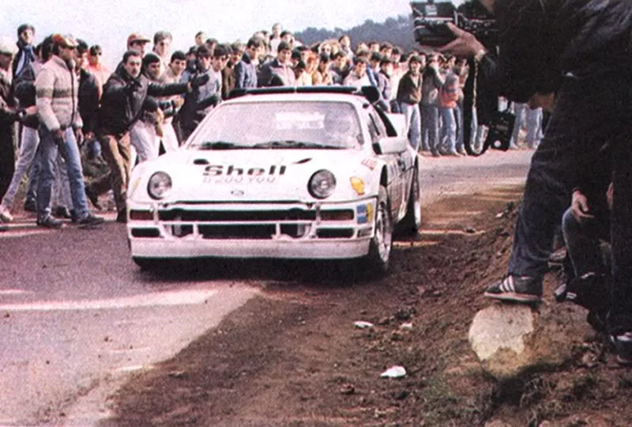

...then came the accident that many had feared, local driver Joaquim Santos had
been officially entered by Ford in a third car. On stage one, when Santos came
over a crest flat out, he found spectators in the road, he avoided them, but
this put him off line and caused him to spin into the huge crowd at high speed,
three spectators were killed and many more were injured.

The aftermath of the horrific accident

Ford did not appear again until round 6, the Acropolis Rally, this would be the
most promising event in the RS200s very short career

Kalle Grundel took the lead from stage 11 to 15, Grundel then arived at service,
a wheel nut was stripped in the rush and the hub change took so long he was out!

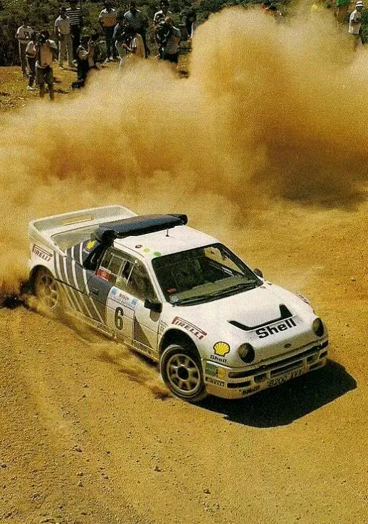

Blomqvist took the lead on stage 17, only to retire immediately, when he put the
car off the road, most unlike Stig :fish:

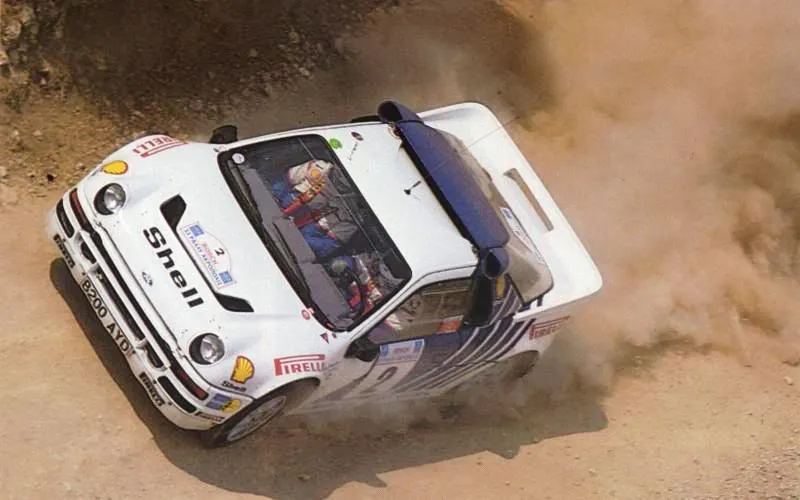

The RS200 offered great access for servicing

---

It should be noted that Ford burned out two RS200 practice cars in Greece prior
to the Acropolis Rally, far worse was the accident in which Marc Surer hit a
tree on the Hessen Rally in Germany, his car burst into flames and his co driver
was killed, the accident also ended Surer's F1 career, the team fitted a plumbed
in fire extinguishing system just before the Acropolis - Amazingly, back in
1986, this was not mandatory.

Back in the UK, Mark Lovell had ben putting in some solid performances on the
British rally championship

Lovell on the Scottish Rally

Lovell famously rolled his RS200 on that Scottish Rally, but he manged to get
going again to bring the car home in second place

By the final British round, Lovell was in contention to take the title. Once
McRae's 6R4 had expired, Lovell was able to stroke it home in 3rd place to
become 1986 British Rally Champion, he did so without winning a single round, I
can't ever remember another driver doing that.

The RS200 was also able to collect another national rally championship, Robert
Droogmans dominated the Belgian rally championship, he won seven out of nine
rounds to take the title

Ford were to make their final WRC appearance with the RS200 on the RAC rally,
three cars were officially entered for Blomqvist, Grundel and Lovell

Lovell was out on stage 20 with a fire, Blomqvist followed him on stage 26 with
a turbo failure

It was left to Grundel to salvage a decent result, this puncture early on didn't
help

In the end, Grundel finished 5th overall, behind the dominant Peugeot and Lancia
teams, but in front of a string of 6R4s

Perhaps if evolution Group B cars not been banned immediately after Toivonen's
accident Corsica, maybe Ford would have fared much better and even taken on the
French and Italian super teams. But this was the end of the RS200s rallying
career.

---

The Toyota Celica Twin Cam Turbo, not exactly a rally car name that rolls off
the tongue. The car was homologated in the summer of 1983, it wasn't exactly
what the engineers at Team Toyota Europe had dreamed of, Japan had given them a
Group B car without 4WD, but it did have a relatively powerful engine (for
1983), this was still early days for turbo charging, but the 4 cylinder, 8valve
turbo engine gave about 320bhp in its original form.

TTE - Rally teams were somewhat smaller back in the '80s

The car made its WRC debut on the 1983 1000 Lakes Rally, drivers were Bjorn
Waldegard, and the young then unknown Finn, Juha Kankkunen. Waldegard finished
in 12th position,but Kankkunen came home an impressive 6th overall.

Kankkunen making his factory backed WRC debut - Finland '83

The car didn't make another showing on the WRC until the Ivory Coast Rally in
October 1983, Waldegard took a win over the Quattro of Mikkola, Per Eklund
brought another Celica home in 3rd position, the Toyota Celica Twin Cam Turbo
had kind of found its niche - African Rallies.

Waldegard taking the first WRC win for the car - '83 Ivory Coast

Final outing of 1983 was the RAC, a three car entry for Waldegard, Kankkunen and
Eklund.

Waldegard - '83 RAC

Kankkunen - '83 RAC

Waldegard and Eklund retired, Kankkunen came home in 7th, 40 minutes behind the
winning Quattro of Blomqvist!

1984

Portugal, both Waldegard and Kankkunen retired, here is Kankkunen

Safari - A second win for Waldegard and the Toyota

Waldegard '84 NewZealand

Waldegard, Finland '84 - Engine failure brought retirement

Kankkunen did take 5th place though

RAC '84 - Waldegard and Kankkunen retired, it was left to Per Eklund to save the
day, he took an excellent 3rd place, only beaten by the 4WD cars of Vatanen and
Mikkola

---

1985

Kankkunen took his first WRC win on the Safari - Run monkey, run!!

Kankkunen was the first driver in the history to win the Safari at first attempt

1985 New Zealand - Kankkunen

KKK flying high - Finland '85

A river crossing during the 1985 Ivory Coast, Kankkunen and Waldegard finished
1-2 respectively

The Ivory Coast Rally (like the Safari) was run on public roads (Whilst Marlboro
were event sponsors, Bastos had the foresight to hand sunstrips to the locals
:lol: )

Kankkunen finished 5th overall on the 1985 RAC, and first 2WD car, he was in
fact so far ahead of the Opel Manta of Russell Brookes, when Alen went off the
road in the Delta S4, Kankkunen stopped and towed him out of a ditch, Toyota
team boss Ove Andersson was said to be far from happy, this mattered little to
Kankkunen, he had been signed by Jean Todt to drive for Peugeot, no need to
remind you how successful that move was.

1986

Safari, Waldegard was joined by two new team mates, Sweden's Lars-Erik Torph and
Germany's Erwin Weber. It was almost the perfect event, Waldegard won, Torph 2nd
and Weber 4th (Alen spoiled the party in the Lancia 037)

The Celica was perfect for African rallies, it was strong, reliable, powerful
(by now it was producing 370bhp and only weighed just over 1000kg), it coluld do
160mph on the fast African roads, and was very simple to repair due to it being
low tech.

The '86 Ivory Coast, Toyota finally got their 1-2-3 finish Waldegard winning
with Torph and Weber following home.

All smiles on the '86 Ivory Coast, from the left - Weber, Waldegard and Torph
celebrate what would be the Group B Toyota's final win, Toyota were unbeaten in
Africa for three years using the Celica.

There was to be one last outing for the car, the very last WRC round in which
Group B cars would be eligible, the 1986 Olympus Rally in Washington State, USA.

The cars of Waldegard and Torph and Steve Millen at scrutineering on the '86
Olympus

Group B would never have been banned if all rounds had been held in the USA,
crowds flock to see the car of Waldegard!

Lars Erik Torph's car during service

Torph took 4th place ahead of Waldegard in 5th

It may not have been the greatest Group B car, but it does hold a place in
rallying history.

---

The Mazda RX7 was one of the least campigned Group B cars, so much so, that some
people will be unaware of its existence.

Mazda put a toe in the water by entering a car on the 1983 Acropolis Rally, the
car was driven by German driver Achim Warmbold, he finished fifteenth (Warmbold
was also team manager at Mazda)

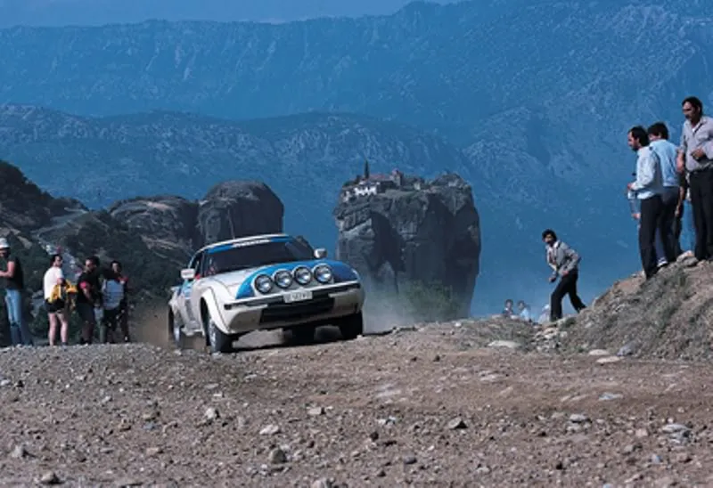

It was a full year before a fully homologated Group B version of the RWD RX7
appeared on the WRC, again on the Acropolis Rally. The Group B version had
approximately 300bhp and weighed just less than 1000kg (Interestingly, Colin
McRae once said the ideal rally car should be RWD and weigh 1000kg - However, I
don't recall Colin saying that it should have a rotary engine, but Mazda always
did things differently!)

Swedish driver Ingvar Carlsson drove one of the cars on the '84 Acropolis, he
retired with differential problems

Achim Warmbold took the first WRC points for Mazda by finishing ninth on the
1984 Acropolis

Carlsson won the Polish Rally in 1984, one of the few wins at international
level for the RX7, although it has to be said that the opposition was not very
strong!

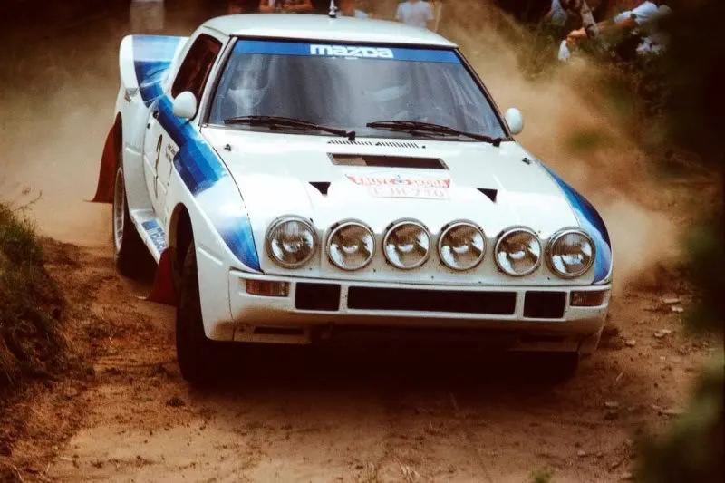

Mazda entered two cars for the final WRC round of 1984, the RAC Rally

Carlsson in car 26...

...he retired with rear axle troubles

The second car on the '84 RAC was driven by Frenchman Phillipe Wambergue. This
great photo shows Wambergue making the RWD car dance, poetry in motion :-) Sadly
he retired with a lost wheel.

---

Marc Duez made an appearance on the 1985 Boucles de Spa driving an RX7, a good
drive saw him finish second, only beaten by the Quattro of Waldegard (Not
difficult to see why a 4WD car beat him)

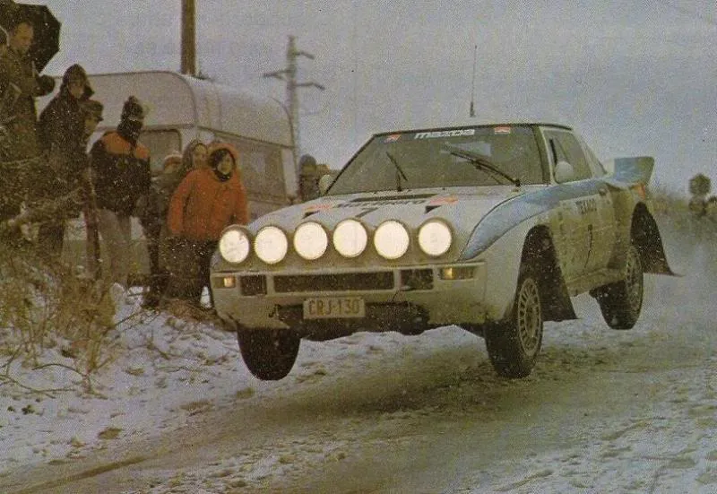

First WRC event of 1985 for Mazda was Ingvar Carlsson's home event, the Swedish
Rally, he came home in eighth place, which was the highest placed 2WD car

Carlsson on the '85 Swedish (I bet the crew member who put the number 8 on
upside down never lived it down!)

The 1985 Acropolis Rally saw the car take its highest finish at WRC level,
Carlsson brought the car home in third place, this remains the highest placed
finish for a rotary engined car on the WRC

The final outing for a factory RX7 was the 1985 RAC Rally.

New Zealand driver, Rod Millen came home in ninth. The large rear wing housed an
oil cooler.

Followed by Ingvar Carlsson in tenth place

The RX7 was never again officially entered on a WRC event, Mazda instead opting
to develop a 4WD car for the new Group A formula for 1986.

A privately entered RX7 did come home in an impressive sixth place on the 1986
New Zealand Rally, only beaten by 4WD Group B cars, the car was driven by local
driver Neil Allport

---

_autohabit, 2009–2011_
