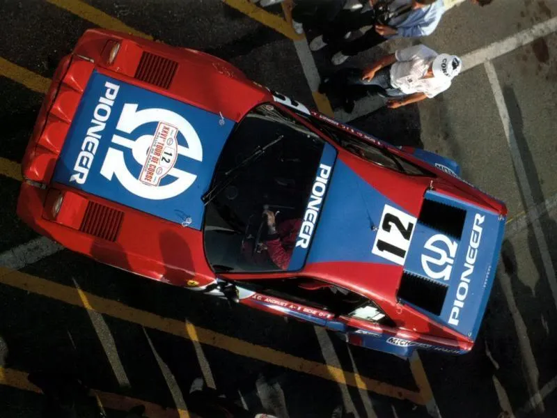
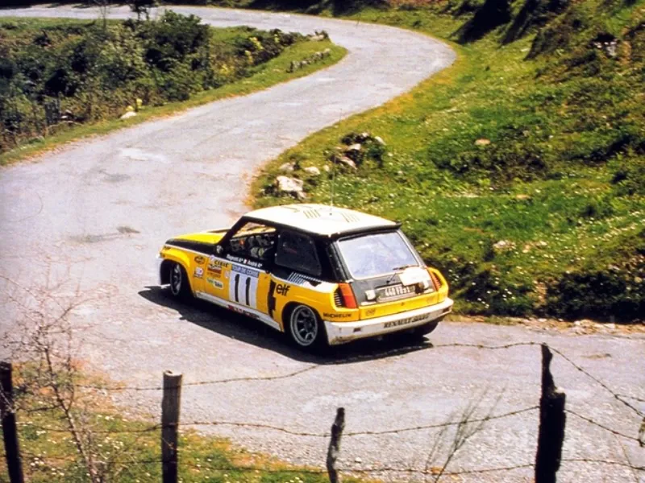
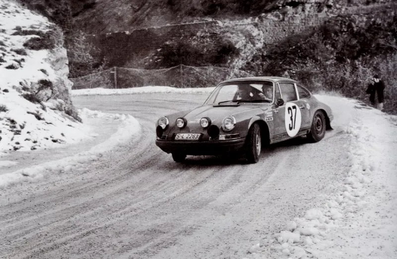

# The Rally Supercars

Most people wil be expecting to see a thread on Group B cars I guess. Ever
wondered what came before Group B? Well, it was Group 4. Homologation rally cars
were required to be built in quantities of 400 road going versions to compete at
international level.

Starting with one of the most amazing rally cars ever to compete on the World
Rally Championship - Ferrari 308

Jean Claude Andruet finished 2nd overall on the 1982 Tour of Corsica, the cars
best WRC result. Andruet had also finished 2nd in the 1981 European Rally
Championship at the wheel of a 308.

The cars pulled a crowd whenever they showed up around the major rallies in
Europe.

Every schoolboys dream, a Ferrari rally car, then they grow up and buy a Porsche
instead 

The car was also entered for the 1982 Monte Carlo Rally, although this photo
shows the car at full chat on snow, the '82 Monte was a fairly snow free affair
which was eventually won by Walter Rohrl in an Opel Ascona 400.

Sadly it all ended in tears with Andruet hitting a bridge and retiring the car,
the 308 rally weighed approximately 1000kg and put out a then healthy 310bhp,
perhaps if Rohrl had been let loose with one of these cars in '82 the record
books might have read somewhat different....

Flying high, same sponsor but new colour scheme, apparently the French importer
of Pioneer Japanese Hi Fi equipment was a motorsport enthusiast and saw the
potential media attention and public reaction a good enough reason to put some
sponsorship the way of Ferrari-France.

In 1983 one the cars was sold to French comic book artist Albert Uderzo, who was
famed for the Asterix cartoons, he used it in club events and eventually sold it
in 1998, the car is now back in it's original condition and resides in the
suburbs of Paris.

---

The reason the headlights were up is that back in the 1980's rallies ran a lot
of stages in darkness, so if the car was not going to make it back into service
before darkness, they would run some daylight stages with lights in place. As
you can see from this shot, the 308 did run with the lights down also.

---

The BMW M1 rally car was run by BMW France during 1982-84. Two drivers were
chosen, both French tarmac experts, first was Bernard Darniche, he was a former
5 time winner of the Tour of Corsica driving Alpine Renaults and Lancia Stratos,
so he was no stranger to rallying exotica.

Here we see Darniche making the car dance during one of it's few appearances
outside France on the Ypres 24 Hours in Belgium.

Especially for Dave here are some more photos from Corsica.

The M1 was the most powerful RWD rally car ever with 430bhp on tap, when it had
chance to get that power down, the M1 was a pretty awesome car, just look at it
laying rubber down in this shot.

The other M1 rally driver was Bernard Beguin, here you can see how clumsy the M1
could be on the tight hairpins of Corsica, the M1 was 200mm wider than it's
biggest rivals. Check out the tyre marks left by the previous cars at the same
corner! As you can see, the M1 was not on quite the same line!!

Those magnificent men and their flying machines B)

---

Next up, quite possibly the most iconic of all the rally supercars, the Lancia
Stratos. Homologated in 1974, the Stratos was of tubular frame construction and
had a tuned 270 bhp Ferrari V6 engine from the Ferrari Dino road car, it goes
without saying that the Stratos was one of the best sounding rally cars of all
time.

Sandro Munari on route to victory during the 1976 Tour de Corse, back then the
Corsican round of the WRC was held in early November, just prior to the RAC
Rally, hence this photo looks more like a scene from a spectator stage on the
RAC rally!

Alitaila were title sponsor to the Lancia team, so Lancia were unique back in
the '70's in having the luxury of being able to fly their rally cars to certain
events, here they are setting off for the 1977 East African Safari.

...and here is one of the cars on that same 1977 Safari Rally, it turned out to
be the wettest Safari ever!

A feature which was not seen again for 10 years when the Group B Peugeot 205 T16
was released, was the ability to remove the front and rear of the bodywork for
servicing. Occasionally the same bodywork was known to detach itself, most
famously on the 1975 RAC Rally with Bjorn Waldegard at the wheel.

Here is Waldegard on route to a home victory on the 1975 Swedish Rally.

Stig Blomqvist won his home event an amazing 7 times, it should have been 8 wins
in Sweden for Stig but a problem on one stage meant he missed out on a victory
in his only Stratos outing in 1978, he completely outclassed the field on just
about every other other stage.

Sandro Munari on his way to 2nd on the 1976 Sanremo, team mate Waldegard took
the win.

The official Lancia rally team stopped using the Stratos at the end of 1978, the
car itself ran out of homologation at the end of 1981, it was then unable to
compete at WRC level after this, incredibly it was still a winner at top level
right until the end. Bernard Darniche won the 1981 Tour de Corse, here he is
during the 1980 Acropolis Rally. Darniche won the European Rally Championship
for drivers using a Stratos in 1976 & 1977, at the time this was the highest
accolade a driver could achieve (WRC drivers crown didn't start until 1979)

Markku Alen gave the car it's final appearance on the 1981 RAC Rally, he led on
the early spectator stages but retired after an accident in the forest.

---

So what was the first car to really make use of the homologation rules that
governed International rallying? Many people will name the Mini Cooper as a
possible candidate, but the Cooper was a Mini with a bigger engine and other
mods, so not really that daring, even if it was a very successful rally car.

The original rally supercar was the Alpine-Renault. Alpine started building
lightweight cars on Renault chassis during the early 1950's in Dieppe. The
Alpine A110 had a glassfibre body, early cars had various engines from 1100 to
1470cc, then a 1600cc, then latterly an 1800cc.

1600cc doesn't sound like a supercar engine right? It produced a reasonable
155bhp but the reason the car went so well was its weight, it tipped the scales
at just 680kg.

Here is Jean-Luc Therier on the 1970 RAC Rally, Therier had already won the
Sanremo and Acropolis rallies during 1970.

Ove Andersson on the 1971 RAC, he had enjoyed a successful season, his win on
the 1971 Monte Carlo Rally had convinced Lancia rally boss Cesare Fiorio to push
ahead and create the Lancia Stratos, so we have a small garage owner in Dieppe
to thank for the Stratos, and every other Group B supercar that followed -
French clutter!

Jean-Pierre Nicolas on the 1972 Monte Carlo, by now the works cars were running
1800cc engines, these gave 175bhp, the cars had gained a little weight and were
now just over 700kg. 12 years later, Nicolas would become the first driver to
score WRC points at the wheel of the 205 T16, a car which he helped to develop.

Morocco 1973, yes thay actually had a WRC round in Morocco back then, car number
1 and the winning car is that of Bernard Darniche (his name keeps showing up in
this thread) Alpine-Renault won the World Championship for makes in 1973, the
first time a world championship for rallying was held. Once the Stratos arrived
in 1974, the Alpine was on a downhill slide, but for a while, like all great
rally cars, it was top dog.

---

Fast forward to the end of the Group 4 era, Renault were back on the scene, this
time they had built a mid engined, RWD version of the Renault 5 with a turbo
charged 1.4 litre engine producing 265bhp, it tipped the scales at 900kg.

The car's first WRC result came on the 1980 Tour de Corse when Bruno Saby came
home 4th overall.

However, probably the first and most famous victory came on the 1981 Monte Carlo
when Jean Ragnotti scored a memorable home victory, but only after the Quattro
of Mikkola hit problems on the Audi's debut event, as the saying goes - That's
Rallying.

Here are a couple of photos from that Monte Carlo Rally 27 years ago.

Renault were very selective on which WRC events they entered, mainly due to the
fact that their motorsport budget was being ploughed into the F1 team. They
entered four cars for the 1981 Tour de Corse, all four cars retired! Turbo
charging and the heat which it created did not mix well with a mid engined
package, there were ways round this, but Renault hadn't quite grasped them at
this point.

Ragnotti on that ill fated 1981 Tour de Corse

Renault finished the 1981 World Rally Championship off with an appearance on the
RAC Rally.

Here is Ragnotti, co driven by British journalist Martin Holmes, they finished a
respectable 5th overall but a massive 24 minutes behind the winning Quattro of
Mikkola, this sounds a massive margin but back then the RAC was run over a
mammoth 65 special stages which amounted to 450 miles timed against the clock!!

I like this photo because it shows the Renault 5 Turbo with big chunky forest
tyres, something rarely seen on these cars.

Team mate Bruno Saby also started the '81 RAC.

1982 - Renault made no mistakes this time and Ragnotti secured victory on the
Tour de Corse

---

Note: Not sure everyone in the US will fully understand the significance the
Ford Escort RS has in the UK, even now in 2008 the greatest number of cars
registered with a competition RAC licence remains the Mark II Escort, even
though they stopped rolling off the production line almost 30 years ago. The
late Colin McRae had one specially built and described it as his favourite rally
car.

Up to now this thread has looked specifically at the out and out homologation
specials, this is the point where that changes. No rally car thread from the
Group 4 era would be complete without the Ford Escorts, namely the Mark I and
Mark II Escorts. This thread will probaly get split into two, due to the long
time span the cars competed (and the number of pics in my collection :click: )

Things started way back in 1968, here is our very own Roger Clark on the 1968
Scottish Rally, an early outing for the car, this was the 1600cc Twin Cam
version, basically the same unit as used in the Lotus Cortinas, it gave 160bhp
and the car weighed 900kg.

Here is Roger Clark again, this time on the 1970 Monte Carlo Rally, note that
the car had now gained the recognisable wheel arch extensions.

The Escort became the staple diet of British rallying in the 1970's, even today
if you ask any rally fan to sum up rallying, they would probably start talking
about an Escort going sideways through the forests.

In 1972 Roger Clark and Tony Mason took a famous victory on the RAC Rally, it
turned out to be the first of eight consecutive victories for the Escort on the
RAC, here follows a photo tribute to those eight victories and the distinctive
colour schemes that the cars all wore (I'm sure we all have our own favouries)

1972 Roger Clark & Tony Mason - ESSO Uniflo

1973 Timo Makinen & Henry Liddon - Milk

1974 Timo Makinen & Henry Liddon - Colibri Lighters

1975 Timo Makinen & Henry Liddon - Allied Polymer

1976 Roger Clark & Stuart Pegg - Cossack Hairspray

1977 Bjorn Waldegard & Hans Thorszelius - British Airways

1978 Hannu Mikkola & Arne Hertz - Eaton Yale lift trucks

1979 Hannu Mikkola & Arne Hertz - Eaton Yale lift trucks (Again!)

---

Roger Clark on the 1976 Monte Carlo, note the rarely seen tarmac spec arches.

One for the motor club quiz night - Who was the last driver to win the 1000
Lakes / Rally Finland without the use of pace notes? Answer Kyosti Hamalainen in
1977, after many of the works cars dropped out it was a chance for the multiple
Finnish Rally Champion to grab his moment of glory and take one of the most
prized trophies in rallying. Remember, Sebastien Loeb only got this in his
trophy cabinet for the first time just a few weeks ago.

Waldegard winning the wettest East African Safari ever in 1977.

A driver not really linked with Escorts is Markku Alen, in 1973 he had this big
accident on the RAC during the early spectator stages, but went on to finish an
impressive 3rd overall. After this he was snapped up by the Fiat group, a
relationship that continued for an incredible 16 years.

Classic combination of Mikkola and Escort - 1979 Rally of Portugal.

Waldegard on the 1979 Quebec Rally, Canada had it's very own WRC round back
then, shame there isn't any top level rallying in North America nowadays, they
have some great rallying terrain.

Another superstar driver in an Escort, Henri Toivonen competed in a 2 car Total
Oils team back in 1979.

His team-mate was an equally young Malcolm Wilson, who is now the Ford WRC team
boss.

Pentti Airikkala in the Yorkshire forests - 1981 Mintex Rally

One of the most famous Escort drivers - Ari Vatanen 1981 Sanremo

Vatanen holds the record for wrecking cars on the WRC, his record makes Colin
McRae look like your grandma :lol: 1981 Ivory Coast Rally

For 1981 Vatanen secured (with the help of his co-driver Dave Richards) a budget
from Rothmans to compete on the WRC, this was the first year of the Quattro, but
Audi were still finding out how to make the car work properly, so it was the
Escorts last chance to take the World title, Vatanen had many accidents but when
he finished 2nd overall on the 1981 RAC Rally he became World Rally Champion,
this was the point that his co-driver retired from the passenger seat and
started Dave Richards Autosport, which would later be renamed Prodrive.

The Escort didn't run out of homologation until the end of 1984, but it never
enjoyed success at the very top level again, a new era of turbo charging and 4
wheel drive was dawning and the Escort had ceased production in 1979.

Here is a very late appearance of the Escort on an international rally, Robert
Droogmans on the 1983 Ardennes Rally in Belgium. Of course, spectators are still
treated to sideways action every weekend in the UK, the Escort will never die,
will it?

---

The Mark II Escort had some serious competition from Italy, in the shape of the
Fiat Abarth 131. Homologated during the 1976 season (Although Fiat had little
intention of using the car in WRC anger until 1977)

There is an interesting story about the 131's first major win. Markku Alen was a
full time driver for the Fiat group for most of the 1970's, August 1976 meant it
was time for his home event - The 1000 Lakes Rally (or what we now know as Rally
Finland) Markku had taken podium finishes on the event many times already, but a
win was surely coming soon. Markku actually got as far as a seat fitting in a
Lancia Stratos for the '76 event, however, for some reason, it never came off.
The Finnish Fiat importer came to Alen's rscue and they offered to help run a
131 if Italy could provide one. Fiat supplied a rally car, one service van and
three mechanics! They also hired three more vans and some tools etc. All the
other help came in the shape of volunteers.

Alen got off to a fairly slow start by his standards, he was struggling during
the night stages and complained of poor lights on the car, it turned out the
lights were full of dry mud from a previous run the car had made in Morocco, the
units were cleaned and faster times immediately appeared. Otherwise the car
running perfectly and by the last night Markku was leading.

One of Markku's sponsors was mobile phone company Mobira, it was reported that
the size of the phone they gave him to use was quite unbelievable! However, when
a misfire came about during the closing stages of the rally that phone made
history when they used it to call Abarth in Italy, it is said that one person
held the phone to the exhaust and Markku revved the car, the engine expert in
Italy gave instructions and the car was nursed home for an amazing win. That
must have been the first use of a mobile phone on a rally and the last time a
WRC event was won using voluntary help! The Italian's talked about this amazing
phone for years, they couldn't understand how Alen had managed to ring them from
the middle of a Finnish forest!!

Here is Markku taking that first win for the 131

Many drivers enjoyed success at the wheel of the 131, here is Jean Claude
Andruet setting off to what would be a win for him on the 1977 Sanremo.

The 1978 Monte Carlo was (in some places) very snowy, here we see two works
cars, I guess this is a stage being cancelled?

It wasn't all snow on that '78 Monte, here is Bernard Darniche on one of the
tarmac sections.

Darniche returned for the 1978 Tour de Corse and another victory.

Here is Walter Rohrl on the 1978 RAC Rally, you will notice that his co driver
looks to be sat in a somewhat odd position, this was tried out in the hope of
improving traction!!

The idea was eventually dropped :huh:

Ulf Gronhlom (Father of Marcus) taking a respectable 4th overall on the 1979
1000 Lakes, Ulf was killed a couple of years later when he was practicing for a
Finnish national rally.

Walter Rohrl - Portugal 1980, Rohrl took the 1980 drivers title in the 131.

Many people only remember Michele Mouton driving for Audi, but in fact she was
spotted by Audi after some brilliant drives in a 131, she finished 5th overall
on the Tour de Corse in 1978, 1979 & 1980 each time at the wheel of a 131. Here
she is in 1980.

Alen took the car to it's final victory on the 1981 Rally of Portugal, by now
the 131 was hitting the same problem as the Escort, it was long in the tooth and
Audi had now unleashed the Quattro.

---

The last of the great Group 4 rally cars has to be the Audi Quattro.

Many people will associate the Quattro with Group B, but the story goes back to
1976, Audi had gained a contract to build a new 4WD vehicle for the German army,
it was called the Iltis and was powered by a four cylinder Audi 80 engine, at
the time, some of the Audi engineers talked about the possibility of building a
4WD version of the Audi 80, one thing led to another and by 1978 a project to
build a 4WD car with a 5 cylinder turbocharged engine was up and running.

Back in 1978 the WRC regulations did not allow 4WD cars. Rather than approach
the FIA, Audi cleverly decided first to first approach the manufacturers
competing in the WRC. Did they have any objections to the ban on 4WD in the WRC
being lifted? No problem was the answer.

The Audi quattro was unveiled at the 1980 Geneva Motor Show. Finnish driver
Hannu Mikkola was chosen as the driver to develop the car.

The first event for the car would be at the end of 1980, the Algarve Rally in
Portugal, Mikkola ran as course car, had he been competing, he would have
comfortably won the rally.

The first proper event for the Quattro would be the opening round of the 1981
WRC - The Monte Carlo Rally. A second driver was hired to compete alongside
Mikkola, French lady driver Michele Mouton, here is Michele during a practice
session for the '81 Monte, note how standard the car looks, if you removed the
decals, it would look like a showroom car (Who would have guessed that less than
5 years later the Quattro would turn into one of the most powerful, outlandish
rally cars ever) Also, Mouton had a deal with BP, but Audi were tied to Castrol,
they coped with this issue though.

Mouton never actually started the '81 Monte, her car had a problem on the
concentration run. Mikkola however made an astonishing start, conditions were
ideal for the Audi, lots of snow, after six stages, Hannu led the event by almot
six minutes!

Sadly the alternator belt failed, then Mikkola left the road and lost a wheel,
Audi completed the rally for test purposes and the car was classified 91st
overall, it had however shown what an awesome car it was.

Next up came the Swedish Rally, an event run entirely on snow and ice, Mikkola
took the car to it's first victory, beating Vatanen in an Escort by nearly two
minutes.

Hopes were high of a victory in Finland, Mikkola was comfortably quickest but
suffered road penalties and finished 3rd overall.

Next event was the Sanremo, history was made, Michele Mouton became the first
lady driver to win a WRC event, beating Henri Toivonen's Lotus Sunbeam by almost
three and a half minutes.

November 1981 meant the RAC Rally, despite rolling the car Mikkola won the event
by over eleven minutes!!

1982 Monte Carlo, Mikkola finished second overall, Walter Rohrl beat him
comfortably in an Opel Ascona 400 after one his legendary drives.

It was not a good Monte for Michele, she had an argument with a wall!!

A new driver was brought into the Audi team for the Swedish Rally, Stig
Blomqvist comfortably taking a win.

Portugal was next, Mouton proved that the Sanremo win was no fluke, she won by
an amazing thirteen minutes :o

Audi put a lot of effort into the 1982 Tour de Corse, but they couldn't get the
car to work on all tarmac events at this point.

Next was the Acropolis, Michele took yet another win, beating Rohrl by over
thirteen minutes.

Due to a certain war taking place in Argentina, the 1982 South American round of
the WRC was held in Brazil, it was a muddy event, Michele took the victory from
Rohrl by.... wait for this - over 35 minutes :o It was clear that under the
right conditions, the Quattro was totally unbeatable.

Here is Michele on that Brazilian round, note the VW badge near the front wheel,
presumably the Audi brand wasn't available to buy in Brazil back in 1982. Also,
note that Audi were running Kleber tyres back then.

Finland '82, Audi took a 1-2 victory, Mikkola beating Blomqvist, Stig was held
in second by team orders.

Sanremo, another 1-2 but this time it was Blomqvist ahead of Mikkola, Mouton was
fourth, with Rohrl third.

The drivers title was now being fought out between Walter Rohrl and Michele
Mouton, just two events remained, the Ivory Coast Rally and RAC. Rohrl hated
rallying in Africa, but was forced to go there unless he wanted a woman to take
the title from him!

By now, Audi had a flamboyant young German team manager by the name of Roland
Gumpert, he would sit alongside Mikkola on the 1982 Ivory Coast Rally as chase
car to Mouton.

Mikkola and Gumpert actually retired about halfway through the event, Gumpert
was known for being a hands on kind of guy, here he is working on Michele's car.

Michele sadly crashed after time control 46 of 54, her father had died on the
eve of that 1982 Ivory Coast Rally, he had been her mentor throughout her
career, so you can imagine her state of mind. Rohrl was the 1982 World Champion.

Yet another 1-2 finish on the '82 RAC, Mikkola ahead of Mouton. This gave Audi
the 1982 manufacurers title. This 4WD rally car had come good.

---

'The Porsche 911, one of the most successful rally cars ever'

I find that statement usually causes a reaction! I think a lot of people dismiss
the 911 as a rally car because its so long since the car was winning
international rallies. The 911 actually pre dates the Group 4 rules themselves,
not only that but it was actually re homologated into Group B (I'll have to go
back to that in the Group B thread)

Porsche started to take rallying seriously in the mid 1960's, this was the era
of the 2 litre 911, for 1967 they signed the brilliant young British driver Vic
Elford away from Ford, the photo below shows Elford on the right with co driver
David Stone during the 1967 Monte Carlo, they finished 3rd overall.

One year later, same pairing, same car, but this time there were no mistakes,
Elford took a famous win, which remains to this day, the last time a British
driver won the Monte Carlo Rally.

A proud moment for any driver, collecting the silverware from Prince Rainier and
Princess Grace of Monaco. It is worth noting that Elford travelled straight to
the USA after this win, one week later he took victory on the Daytona 24 Hours,
Porsche's first ever 24 hour race victory, not a bad few days work.

On the right of this photo, the man with the two cameras is Huschke von
Hanstein, he was public relations manager at Porsche before public relations
existed! von Hanstein actually won the 1940 Mille Miglia driving for BMW, stood
next to him is Pauli Toivonen (Henri's father) who finished second to Elford in
1968.

A small crowd gathers for the start of the 1969 Mote Carlo Rally!

Elford switched to the race team full time for 1969, Porsche signed Swedish
driver Bjorn Waldegard for their rally team.

Waldegard took the 911 to victory, not just on the 1969 Monte but also on the
1970 event, three Monte Carlo Rallies on the bounce for the 911.

The 911 performed on all types of events, here is Waldegard on his way to 2nd
place on the 1971 RAC Rally.

An interesting chase car, 1978 would be the 4th Monte Carlo win for the 911,
this time the car was a 3.0 litre, 300bhp model, weighing in at 1000kg, car #3
is the winning car, driven by Frenchman Jean-Pierre Nicolas. The car was
prepared by Almeras.

Waldegard was back with the 911 for the 1978 Safari, he very nearly won but had
to settle for 2nd.

1980 would mark the last WRC victory for the 911, Jean-Luc Thérier winning the
Tour de Corse in this Almeras car.

Many people link Walter Röhrl and Porsche nowadays, Röhrl only actually ever ran
a 911 once on a WRC event, the 1981 Sanremo, back then the Sanremo was run on
tarmac for the first leg, so it was no surprise that Röhrl led the event as they
entered the second day of the event, he started to slip back when the cars got
to the gravel section, the Quattro was coming of age (see elsewhere in this
thread) Röhrl eventually retired after 4 of 5 days with gearbox problems, it
must have been quite something to see the then world champion at the wheel of a
911.

1982 would see the end of Group 4, some thought this would be the end of the 911
in rallying, quite a few drivers sampled the car for the '82 season.

Guy Frequelin finishing 4th on the Monte Carlo Rally, in front of him in 3rd was
his Almeras team mate Jean-Luc Thérier.

Waldegard was reunited with the 911 yet again.

Per Eklund, Finland 1978

Bring back the 911 to top class rallying!!

---

Talbot Sunbeam Lotus. Well, the clue is in the name, Talbot Sunbeam doesn't
quite cut it without the addition of the Lotus tag. In 1978 Chrysler UK
approached Lotus Cars to see if they could find an engine to drop into a limited
run of homologation special Sunbeams, this would be a car to take on the mighty
Ford Escort RS which had won the RAC Rally every year since 1972. Lotus had a
suitable engine, a 2.2 litre, twin cam, 16 valve unit, which when fitted with
twin carburettors would produce 240bhp in rally trim.

By 1979 the team was preparing for a rally programme. Tony Pond was the lead
driver but the car was not immediately reliable and good results were thin on
the ground.

The highlight of the 1979 season came when Tony Pond and Ian Grindrod took the
car to 4th overall on the Sanremo Rally.

By 1980, Pond had gone back to driving for British Leyland and the TR7 V8. Two
new drivers had been hired, 1977 French Rally Champion Guy Fréquelin and a young
Finn - Henri Toivonen.

Here we see Toivonen in typical full flight action during the 1980 Rally of
Portugal, he retired with rear axle problems but team mate Fréquelin came home
in 3rd.

By the end of 1980 the Sunbeam Lotus was becoming a reliable and capable rally
car, Toivonen had been watched carefully by team manager Des O'Dell (and
sometimes no doubt he had bitten off Toivonen's ear for his reckless rally
driving)

This picture shows Des O'Dell (centre) with Toivonen and co driver Paul White.

Toivonen, at the age of 24, became the youngest ever winner of a WRC event when
he won the 1980 RAC, this was probably the finest hour for the Sunbeam Lotus.

The same driver line up was kept for 1981. This is Fréquelin during service on
the Rally of Portugal, interesting lighting pod set up.

Fréquelin again, this time during the 1981 Tour de Corse, an excellent 2nd
overall, by now he was becoming Ari Vatanen's most serious threat to the 1981
world drivers title.

Sanremo recce 1981 - On the left (in the foreground) is Talbot's new engineer
David Lapworth with Toivonen in the background, Toivonen had been practicing the
stages in the black car, it was not unusual to practice stages 6 times or more
at high speed back then, Lapworth had driven out in one of the proper rally cars
to meet up with Toivonen.

Toivonen stormed to 2nd overall on that 1981 Sanremo, only beaten by the
'unbeatable' Quattro of Mouton. Henri loved rallying in Italy in front of the
enthusiastic crowds.

1981 saw Talbot take the world title for makes, but Vatanen won the drivers
title from Fréquelin.

1982 - Stig Blomqvist took the Lotus Sunbeam to 8th on the RAC Rally, this would
be the end of the line for the car, by now Peugeot (Talbot's parent company)
were busy developing the 205 T16...

Summing up, it had not been a bad 4 years for the a small team, taking a world
title and winning the RAC Rally.

---

_autohabit, 2008–2009_
