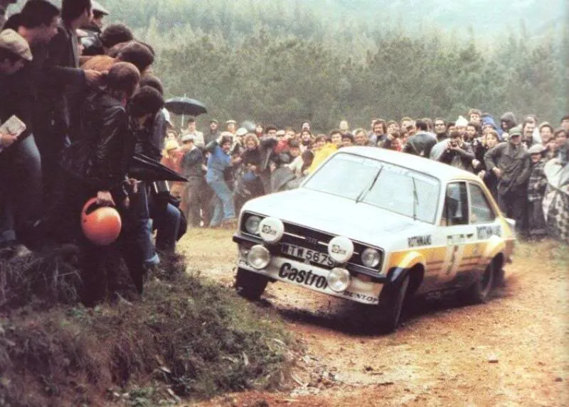
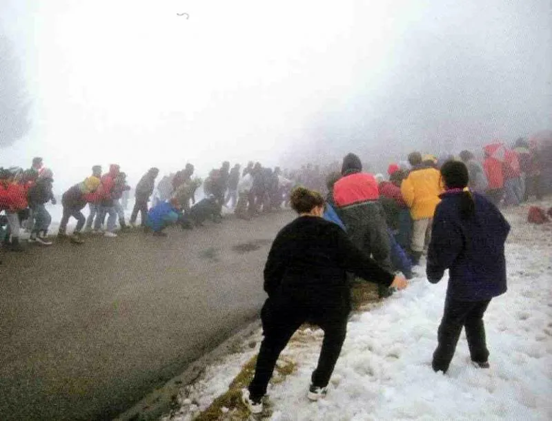

# Those Crazy Rally Spectators

Growing up in the 1970s, I picked up on a sport called rallying, it was becoming
a major spectator sport in many countries, as rallying made its way into the
1980s, it started to become almost out of control in certain parts of the world.

Here follows a photographic tribute to rally spectators around the world, I
guess this could become one of my seemingly endless threads, hopefully it will
capture the spirit and magic that only rallying can offer to motorsport fans.

Back in 1960, the RAC Rally became a closed road / special stage event, prior to
this it had been a series of time trials around Britain.

The winner of that 1960 RAC Rally was Swedish driver Erik Carlsson in a SAAB,
looking at this photo, it is hard to believe it, but this was the start of
something big! Note the lack of spectators, but word was spreading...

...Fast forward 25 years, some might say this was the monster that had been
created, Ari Vatanen drives flat out through a sea of spectators on the 1985
Rally of Portugal

Miki Biasion - 1986 Sanremo Rally, last appearance of the Group B cars in front
of the Italian fans

---

I guess that most motorsport fans have had favourite drivers over the years, for
me there are three drivers that really stand out in rallying, when you stood at
a corner, you just knew that these guys were the most likely to try something
different, they became the spectators favourites, legends in their chosen sport.

Ari Vatanen - 1979 Rally of Portugal

Henri Toivonen - 1983 Sanremo Rally

Colin McRae - 1995 Rally of Portugal (Anybody who says that the crowds died off
when Group B was banned, well take a look at this!)

---

Local heroes, all countries have them.

Soundtrack - Alfa Romeo V6, Surface - Tarmac roads with hairpin bends in the
South of France. The 1985 Garrigues Rally.

Corsica 1984, local BMW importer Patrick Bernardini was known for his giant
killing drives on the Tour de Corse, 323i - Another 6 cylinder RWD rally car,
always popular with the crowds

Portuguese driver Jose Miguel Faria flying high on the 1985 Rally of Portugal,
he came home 6th overall, one of the very last results for a MkII Escort at top
level

---

Not until 1991 did Spain host a round of the World Rally Championship, here are
a few photos taken in the 1980s on the Spanish National Rally Championship,
Spanish spectators were (and still are) equally as enthusiastic as the
Portuguese fans!

Salvador Servià on the 1984 Costa Brava Rally, Servià went on to win the Spanish
title in 1985 & '86

The 1985 Girona-Guillerias Rally, based in the province of Girona in
north-eastern Spain. At the wheel of the Renault 5 Turbo is a then unknown
driver by the name of Carlos Sainz, he would go on to greater things!

Antonio Zanini on the same event, exploring the same piece of road! Zanini was
an eight time Spanish Rally Champion, he also won the European Rally
Championship in 1980

---

Masochist - definition according to the dictionary 'Enjoyment of an activity or
situation that most people would find very unpleasant' Rally spectator is not
actually listed, but anyone who will travel for hours, then wait in all weathers
just to see a car once for a few seconds and possibly get pelted with stones
etc, well I'll let you make your own mind up!

Antonio Tognana - 1982 Sanremo, Tognana actually won the 1982 Italian Rally
Championship driving this Ferrari 308, he never competed outside of Italy

Ari Vatanen '83 Sanremo

Vatanen again, Sanremo 1984

---

Always try to find a safe place to watch!

On top of a rock? Ari Vatanen 1981 Portugal

Up a tree :-) Timo Salonen 1985 Portugal

Or find a good solid piece of land to hide behind. Jean Ragnotti recovered from
this impact to finish top 2WD car and 7th overall on the 1995 Monte Carlo Rally,
his last WRC points scoring result

---

The British rally spectator of the 1970s could often be seen wearing the woolen
bobble hat :-) Here is Timo Makinen on his way to a hat trick of wins on the
1975 RAC Rally, co driver Henry Liddon can be seen enjoying the view, until the
1990s the RAC was a blind event, so no pace notes were read.

The stupid rally spectator! This photo was also taken on the 1975 RAC Rally, I
have also seen this sort of thing, people pushing prams whilst rally cars are
competing on the stages, madness!! For the record books, the Triumph Dolomite
Sprint was driven by Brian Culcheth

Because the RAC Rally was such a marathon event, there was usually no problem
with crowds, the UK also traditionally has called upon its huge base of motor
clubs to provide marshalls for the event. Roger Clark on his way to a popular
home win in 1976, it would be another 18 years until another British driver won
the RAC again, when Colin McRae won for Subaru in 1994, that was a long wait for
British fans.

---

Jump!

Bernard Beguin - 1985 Antibes Rally in the south of France, at the controls of a
Group B Porsche 911

Armin Schwarz - Rally of Portugal 2000

Schwarz again, Monte Carlo, but this time the spectator is jumping instead of
the car!

---

Anticipation, you have to have been to a rally to understand this fully, 1994
Monte Carlo Rally

Privateer Lancia 037 of Francis Serpaggi on the '83 Monte, on his way to a top
ten finish

There's always one. 1986 Monte Carlo

---

Today it's the Brits in Portugal

Tony Pond 1986

Malcolm Wilson, also 1986

1990s - Colin McRae

2000 - Richard Burns

---

More masochists!

Water - Audi 1982 New Zealand

Snow - Juha Kankkunen 1986 Monte Carlo

Gravel - Didier Auriol 1987 Sanremo

---

Jean-Claude Andruet on the 1982 Cevennes Rally in the south of France

Jean-Luc Thérier during the 1984 Tour Auto (Also known as the Tour de France -
But generally referred to as Tour Auto, for obvious reasons!)

Audi - 1984 Portugal

---

One of the most popular corners on the WRC in recent years, was the flyover on
the Viladrau stage of the Catalunya Rally

Colin McRae - 1990s

Richard Burns in 2000

But perhaps most well remembered was the 2002 rally, this photo of Colin McRae
shows some tell tale tyre marks left by the rally leader Gilles Panizzi

Panizzi had a 45 second lead going into the final stages of the rally, so he
decided he would entertain the crowd with a donut mid stage!

For those who can't remember (or want to see the Panizzi donut again) here it
is. I would have loved to be at that corner, judging by the reaction of the co
driver (Gilles brother Hervé) it looks like even he didn't know that Gilles was
going to pull that one off, a classic WRC moment :drive:

<video src="../img/Y3lycIaNMfc.mp4" controls></video>

---

Back to 1977 today

This was the year of the wettest Safari Rally in history, you had to be a hardy
type to watch this one. Roger Clark - He ironically retired with water pump
failure!

Finland's Simo Lampinen at the same water crossing in the awesome Lancia Stratos

Rally of Portugal - Markku Alen on his way to victory

When you've waited for hours in the rain, it's always nice when you are not left
disappointed, Stig Blomqvist thrills fans on the 1000 Lakes Rally with his
mastery of the front wheel drive Saab 99.

---

Stig Blomqvist 1985 Monte Carlo Rally

Bertrand Balas driving an Alfa Romeo 33 4x4 on the '86 Monte Carlo, I never even
knew Alfa Romeo built a 4WD car?! Balas retired but his team mate won Group N

Alain Oreille 1988 Monte Carlo - Renault 11 Turbo

The Trabant enjoyed a cult following after the fall of the Berlin Wall - 1992
Monte Carlo

---

Jean-Luc Therier 1981 Rally of Portugal

Timo Salonen - 1986 Sanremo with some rather excited Italian fans!

Kenneth Eriksson Portugal 1997 - For once, some not so crazy rally spectators.

---

Colin McRae - A man who never let the spectators down:OMG:

1992 was McRae's fisrt appearance in Finland, as can be seen from the somewhat
battered car \[done\]

1993 Tour de Corse

Monte Carlo 1998

Tour de Corse 1998, I love the crowd reaction in this shot :surprised

---

Spanish driver Antonio Zanini giving the Talbot Sunbeam Lotus one last WRC
fling, and the crowds one last thrill, taking 6th overall on the 1983 Rally of
Portugal, probably the car's last points finish. Looks like the co driver has
found time to wave at the photographer!

Markku Alen - Portugal 1984

Jean-Claude Andruet in the Chardonnet Lancia Rally - 1983 Cevennes Rally

I'm not sure on exact detail for this photo, my guess is 1984 Acropolis. I know
one thing though, these two are definitely crazy rally spectators!

---

_autohabit, 2009–2011_
